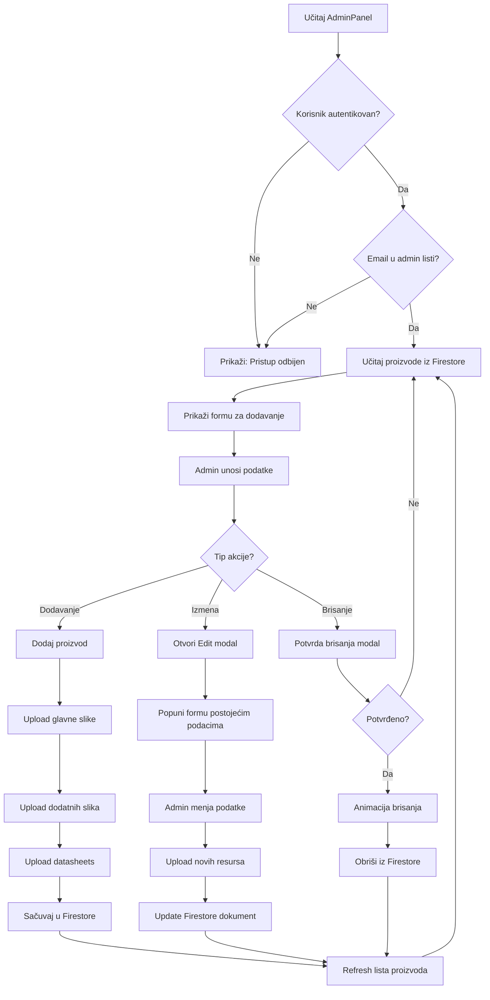

# 🛠️ AdminPanel - Tehnička Dokumentacija

**Poslednja izmena:** 2025-11-02  
**Verzija:** 3.0 - REFACTORED ⚡  
**Komponenta:** `/src/pages/shop/AdminPanel.jsx`  
**Tip refaktoringa:** Modularna arhitektura sa 8 komponenti

---

## 📋 Pregled

AdminPanel je kompleksna React aplikacija koja omogućava administratorima potpunu kontrolu nad proizvodima u e-commerce platformi. Komponenta implementira CRUD operacije (Create, Read, Update, Delete) uz napredno upravljanje multimedijalnim sadržajem i modernim korisničkim interfejsom.

**VAŽNO:** U verziji 3.0, komponenta je refaktorisana iz monolitnog fajla od **782 linije** u **modularnu arhitekturu** sa 8 specijalizovanih komponenti, popravljajući kritične greške u Framer Motion animacijama i poboljšavajući održivost koda.

### Ključne Karakteristike

- ✅ **Dodavanje, izmena i brisanje proizvoda** sa validacijom
- ✅ **Upravljanje slikama** - glavna slika + dodatne slike sa reorderingom
- ✅ **Lokalizovano formatiranje cena** - automatski separator za hiljade (RSD)
- ✅ **Modal za prikaz slika** - zoom i preview funkcionalnost
- ✅ **Karakteristike proizvoda** - dinamičko dodavanje key-value parova
- ✅ **Upload datasheets** - PDF i dokumenti
- ✅ **Software toggle** - posebno označavanje softverskih proizvoda
- ✅ **Responsive dizajn** - desktop i mobile optimizovan
- ✅ **3D animacije** - Framer Motion za smooth UX (FIXED u v3.0) 🔧
- ✅ **Firebase integracija** - Firestore Database + Storage
- 🆕 **Modularna arhitektura** - 8 reusable komponenti
- 🆕 **Poboljšana održivost** - jasna separacija odgovornosti

---

## 🏗️ Arhitektura Komponenti (v3.0)

### Modularna Struktura

AdminPanel je sada organizovan u 8 glavnih komponenti, svaka sa jasnom odgovornošću:

```
/src/pages/shop/
└── AdminPanel.jsx (GLAVNI ORCHESTRATOR - 782 linije)
    ├── State management
    ├── Firebase operacije
    ├── Business logic
    └── Component composition

/src/components/AdminPanel/
├── ProductForm.jsx          → Form za dodavanje proizvoda
├── ProductImageGallery.jsx  → Galerija slika sa reordering-om (FIXED)
├── ProductFeatures.jsx      → Karakteristike proizvoda
├── ProductDatasheets.jsx    → Datasheets dokumenti
├── ProductList.jsx          → Lista/tabela proizvoda
├── ProductModal.jsx         → Mobile modal za proizvod
└── DeleteConfirmModal.jsx   → Modal za potvrdu brisanja

/src/components/UI/
└── EditProductModal.jsx     → Enhanced modal za izmenu (Updated)
```

### Dijagram Toka Komponenti

```
┌─────────────────────────────────────────────────────────────┐
│                      AdminPanel.jsx                         │
│  (Main Orchestrator - State, Firebase, Business Logic)     │
└─────────────────────────────────────────────────────────────┘
                          │
         ┌────────────────┼────────────────┐
         │                │                │
         ▼                ▼                ▼
┌─────────────────┐ ┌──────────────┐ ┌─────────────────┐
│  ProductForm    │ │ ProductList  │ │  EditProduct    │
│                 │ │              │ │  Modal          │
│  ├─ Image       │ │ ├─ Desktop   │ │                 │
│  │  Gallery     │ │ │  Table     │ │  ├─ Image       │
│  ├─ Features    │ │ ├─ Mobile    │ │  │  Gallery     │
│  └─ Datasheets  │ │ │  Cards     │ │  ├─ Features    │
└─────────────────┘ │ └─ Actions   │ │  └─ Datasheets  │
                    └──────────────┘ └─────────────────┘
                          │
         ┌────────────────┼────────────────┐
         ▼                ▼                ▼
┌─────────────────┐ ┌──────────────┐ ┌─────────────────┐
│ ProductModal    │ │ DeleteConfirm│ │   LepModal      │
│ (Mobile only)   │ │ Modal        │ │ (Image preview) │
└─────────────────┘ └──────────────┘ └─────────────────┘
```

---

## 📦 Detaljna Dokumentacija Komponenti

### 1. AdminPanel.jsx (Glavni Orchestrator)

**Lokacija:** `/src/pages/shop/AdminPanel.jsx`  
**Linije:** 782  
**Odgovornost:** Centralno upravljanje state-om, Firebase operacije, orkestracija子komponenti

#### State Management

```javascript
// Autentifikacija
const [allowed, setAllowed] = useState(null); // Admin pristup

// Proizvodi
const [products, setProducts] = useState([]); // Lista svih proizvoda
const [newProduct, setNewProduct] = useState({...}); // Form za novi proizvod
const [editProduct, setEditProduct] = useState(null); // Proizvod za izmenu

// UI State
const [loading, setLoading] = useState(false);
const [uploadProgress, setUploadProgress] = useState(0);
const [editUploadProgress, setEditUploadProgress] = useState(0);
const [deleteConfirm, setDeleteConfirm] = useState(null);
const [selectedProduct, setSelectedProduct] = useState(null); // Mobile modal
const [imageModal, setImageModal] = useState({ open: false, src: "", text: "" });
```

#### Ključne Funkcije

| Funkcija | Opis | @intellisense Tag |
|----------|------|-------------------|
| `fetchProducts()` | Učitava sve proizvode iz Firestore | @async @firebase |
| `handleAddProduct()` | Dodaje novi proizvod sa upload-om resursa | @async @firebase @validation |
| `handleEditSubmit()` | Izmena postojećeg proizvoda | @async @firebase |
| `handleDelete()` | Brisanje proizvoda sa 3D animacijom | @async @firebase @animation |
| `formatPrice()` | Formatira cenu za prikaz (sr-RS) | @formatter @localization |
| `formatPriceInput()` | Formatira unos cene tokom kucanja | @formatter @realtime |
| `parsePriceInput()` | Parsira formatiranu cenu u broj | @parser |
| `simulateUpload()` | Simulira upload progress za UX | @animation @ux |

#### Props Propagacija

AdminPanel prosleđuje funkcije i state dole komponentama preko props:

```javascript
<ProductForm
  product={newProduct}
  onChange={handleChange}
  onSubmit={handleAddProduct}
  onFileChange={handleFile}
  formatPriceInput={formatPriceInput}
  parsePriceInput={parsePriceInput}
  loading={loading}
  uploadProgress={uploadProgress}
  // ... još 10+ props
/>
```

---

### 2. ProductForm.jsx

**Lokacija:** `/src/components/AdminPanel/ProductForm.jsx`  
**Odgovornost:** Kompletan form za dodavanje novih proizvoda

#### Props Interface

```typescript
interface ProductFormProps {
  product: ProductState;              // Product data
  onChange: (e: Event) => void;       // Field change handler
  onSubmit: (e: Event) => void;       // Form submit
  onFileChange: (e: Event) => void;   // Main image file change
  formatPriceInput: (value: string) => string;  // Price formatter
  parsePriceInput: (value: string) => string;   // Price parser
  loading: boolean;                   // Loading state
  uploadProgress: number;             // Upload progress (0-100)
  
  // Image gallery handlers
  onMultipleImagesChange: (e: Event) => void;
  onRemoveImage: (index: number) => void;
  onMoveImageUp: (index: number) => void;
  onMoveImageDown: (index: number) => void;
  onImageClick: (src: string, text: string) => void;
  
  // Features handlers
  onAddFeature: () => void;
  onUpdateFeature: (index: number, field: string, value: string) => void;
  onRemoveFeature: (index: number) => void;
  
  // Datasheets handlers
  onDatasheetsChange: (e: Event) => void;
  onRemoveDatasheet: (index: number) => void;
  
  // Markdown handlers
  onMarkdownFilesChange: (files: FileList) => void;
  onRemoveMarkdownFile: (index: number) => void;
}
```

#### Struktura

```jsx
<form onSubmit={onSubmit}>
  {/* Osnovna polja */}
  <FloatingLabelInput name="name" label="Naziv proizvoda" />
  <FloatingLabelInput name="category" label="Kategorija" />
  
  {/* Cena sa formatiranjem */}
  <div className="relative">
    <FloatingLabelInput 
      name="price" 
      value={formatPriceInput(product.price)}
      onChange={(e) => {
        const numericValue = parsePriceInput(e.target.value);
        onChange({ ...e, target: { name: 'price', value: numericValue } });
      }}
    />
    {/* RSD Badge */}
    {/* Tooltip hint */}
  </div>
  
  {/* Glavna slika */}
  <input type="file" accept="image/*" onChange={onFileChange} />
  {product.imgPreview && <ProgressiveImage src={product.imgPreview} />}
  
  {/* Sub-komponente */}
  <ProductImageGallery {...imageGalleryProps} />
  <ProductFeatures {...featuresProps} />
  <ProductDatasheets {...datasheetsProps} />
  <SoftwareToggle {...softwareProps} />
  
  {/* Submit dugme */}
  <button type="submit" disabled={loading}>
    {loading ? 'Dodavanje...' : 'Dodaj proizvod'}
  </button>
  
  {/* Progress bar */}
  {uploadProgress > 0 && <ProgressBar progress={uploadProgress} />}
</form>
```

#### Dizajn Features

- 🎨 Glassmorphism pozadina (`rgba(203, 207, 187, 0.1)` + `backdrop-blur`)
- ✨ Framer Motion hover efekti na svim input poljima
- 📱 Fully responsive (flex-col na mobile, flex-row na desktop)
- 🌈 Brendirane boje (#6EAEA2, #1E3E49, #91CEC1)

---

### 3. ProductImageGallery.jsx (⚠️ FIXED ANIMATIONS)

**Lokacija:** `/src/components/AdminPanel/ProductImageGallery.jsx`  
**Odgovornost:** Upload i reordering dodatnih slika  
**Kritični Fix:** Framer Motion rotate animation greške

#### Props Interface

```typescript
interface ProductImageGalleryProps {
  images: Array<{ file: File, preview: string }>;
  onImagesChange: (e: Event) => void;
  onRemoveImage: (index: number) => void;
  onMoveImageUp: (index: number) => void;
  onMoveImageDown: (index: number) => void;
  onImageClick: (src: string, text: string) => void;
}
```

#### Framer Motion Bug Fix 🐛 → ✅

**Problem:**  
Spring animacije sa više od 2 keyframes su bacale grešku:
```
"Only two keyframes currently supported with spring and inertia animations. 
Trying to animate 0,-10,10,-10,0"
```

**Stari kod (BUGGY):**
```javascript
whileHover={{ 
  scale: 1.3,
  rotate: [0, -10, 10, -10, 0], // ❌ 5 keyframes sa spring-om
  backgroundColor: "#91CEC1",
}}
transition={{ type: "spring", stiffness: 400, damping: 10 }}
```

**Novi kod (FIXED):**
```javascript
whileHover={{ 
  scale: 1.3,
  rotate: -15, // ✅ Jedan value (ili max 2: [0, -15])
  backgroundColor: "#91CEC1",
}}
transition={{ type: "spring", stiffness: 400, damping: 10 }}
```

**Alternativno rešenje:**
```javascript
// Za multi-keyframe, koristi 'tween' umesto 'spring'
whileHover={{ 
  rotate: [0, -10, 10, -10, 0],
}}
transition={{ 
  type: "tween", // ✅ Tween podržava više keyframes
  duration: 0.5,
  ease: "easeInOut"
}}
```

#### UI Komponente

**Reorder Dugmad:**
```jsx
{/* Gore dugme */}
<button
  onClick={() => onMoveImageUp(idx)}
  disabled={idx === 0}
  className="bg-gradient-to-br from-[#6EAEA2] to-[#91CEC1]"
  style={{
    backdropFilter: "blur(10px)",
    border: "1px solid rgba(255, 255, 255, 0.3)",
  }}
>
  <FiChevronUp size={16} strokeWidth={3} />
</button>
```

**Zoom Overlay:**
```jsx
<div 
  className="absolute inset-0 group-hover:from-[#6EAEA2]/30"
  onClick={() => onImageClick(img.preview, `Dodatna slika ${idx + 1}`)}
>
  <FiZoomIn size={28} />
</div>
```

#### Responsive Behavior

- **Mobile:** Reorder dugmad uvek vidljiva (`opacity-100`)
- **Desktop:** Vidljiva samo na hover (`md:opacity-0 md:group-hover:opacity-100`)
- **Grid:** 3 kolone (mobile) → 4 (sm) → 6 (md+)

---

### 4. ProductFeatures.jsx

**Lokacija:** `/src/components/AdminPanel/ProductFeatures.jsx`  
**Odgovornost:** Upravljanje karakteristikama proizvoda (key-value parovi)

#### Props Interface

```typescript
interface ProductFeaturesProps {
  features: Array<{ label: string, value: string }>;
  onAddFeature: () => void;
  onUpdateFeature: (index: number, field: string, value: string) => void;
  onRemoveFeature: (index: number) => void;
}
```

#### Struktura

```jsx
<div>
  <h4>Karakteristike</h4>
  <button onClick={onAddFeature}>Dodaj karakteristiku</button>
  
  <AnimatePresence>
    {features.map((feature, idx) => (
      <Motion.div
        key={idx}
        initial={{ opacity: 0, x: -20, scale: 0.9 }}
        animate={{ opacity: 1, x: 0, scale: 1 }}
        exit={{ opacity: 0, x: -20, scale: 0.9 }}
      >
        <input 
          placeholder="Naziv (npr. Težina)"
          value={feature.label}
          onChange={(e) => onUpdateFeature(idx, "label", e.target.value)}
        />
        <input 
          placeholder="Vrednost (npr. 2kg)"
          value={feature.value}
          onChange={(e) => onUpdateFeature(idx, "value", e.target.value)}
        />
        <button onClick={() => onRemoveFeature(idx)}>
          <FiTrash2 />
        </button>
      </Motion.div>
    ))}
  </AnimatePresence>
</div>
```

#### Dizajn

- 🎨 Background: `rgba(145, 206, 193, 0.1)` (svetlo teal)
- ✨ Slide-in animacija sa leva (`x: -20 → 0`)
- 🗑️ Hover efekat na delete dugme (scale: 1.1)

---

### 5. ProductDatasheets.jsx

**Lokacija:** `/src/components/AdminPanel/ProductDatasheets.jsx`  
**Odgovornost:** Upload i prikaz datasheet fajlova (PDF, DOC)

#### Props Interface

```typescript
interface ProductDatasheetsProps {
  datasheets: Array<{ file: File, name: string }>;
  onDatasheetsChange: (e: Event) => void;
  onRemoveDatasheet: (index: number) => void;
}
```

#### Struktura

```jsx
<div>
  <h4>Datasheets / Preuzimanja</h4>
  <label>
    <FiPlus /> Dodaj datoteke
    <input 
      type="file" 
      accept=".pdf,.doc,.docx" 
      multiple 
      onChange={onDatasheetsChange} 
    />
  </label>
  
  <AnimatePresence>
    {datasheets.map((ds, idx) => (
      <Motion.div
        key={idx}
        whileHover={{ scale: 1.02, x: 5 }}
      >
        <Motion.div animate={{ rotate: [0, 10, -10, 0] }}>
          <FiFile size={20} />
        </Motion.div>
        <span>{ds.name}</span>
        <button onClick={() => onRemoveDatasheet(idx)}>
          <FiX />
        </button>
      </Motion.div>
    ))}
  </AnimatePresence>
</div>
```

#### Animacije

- 📂 File ikona sa continuous rotate animacijom
- ✨ Hover slide efekat (`x: 0 → 5px`)
- 🎨 Background: `rgba(30, 62, 73, 0.05)` (tamna nijansa)

---

### 6. ProductList.jsx

**Lokacija:** `/src/components/AdminPanel/ProductList.jsx`  
**Odgovornost:** Prikaz liste proizvoda (desktop tabela, mobile kartice)

#### Props Interface

```typescript
interface ProductListProps {
  products: Array<Product>;
  formatPrice: (price: number) => string;
  onEdit: (product: Product) => void;
  onDelete: (product: Product) => void;
  onProductClick: (product: Product) => void; // Mobile only
  allowed: boolean; // Admin flag za skrivene cene
}
```

#### Desktop Layout (lg+)

```jsx
<table className="min-w-full">
  <thead>
    <tr>
      <th>Slika</th>
      <th>Naziv</th>
      <th>Kategorija</th>
      <th>Cena (RSD)</th>
      <th>Akcije</th>
    </tr>
  </thead>
  <tbody>
    {products.map(prod => (
      <tr key={prod.id} data-product-id={prod.id}>
        <td><ProgressiveImage src={prod.imgUrl} /></td>
        <td>{prod.name}</td>
        <td>{prod.category}</td>
        <td>{formatPrice(prod.price)} RSD</td>
        <td>
          <button onClick={() => onEdit(prod)}>Izmeni</button>
          <button onClick={() => onDelete(prod)}>Obriši</button>
        </td>
      </tr>
    ))}
  </tbody>
</table>
```

#### Mobile Layout (<lg)

```jsx
<div className="grid grid-cols-1 sm:grid-cols-2 gap-4">
  {products.map(prod => (
    <div 
      key={prod.id} 
      onClick={() => onProductClick(prod)}
      className="bg-white rounded-xl shadow-md p-4"
    >
      <ProgressiveImage src={prod.imgUrl} />
      <h3>{prod.name}</h3>
      <p>{prod.category}</p>
      <p className="font-bold">{formatPrice(prod.price)} RSD</p>
    </div>
  ))}
</div>
```

#### Features

- 📱 Responsive: Tabela (desktop) vs Kartice (mobile)
- 🔒 Skrivene cene vidljive samo adminima
- ✨ Hover efekti na row-ovima (`hover:scale-[1.01]`)
- 🎯 `data-product-id` atribut za animacije brisanja

---

### 7. ProductModal.jsx

**Lokacija:** `/src/components/AdminPanel/ProductModal.jsx`  
**Odgovornost:** Mobile modal za akcije na proizvodu

#### Props Interface

```typescript
interface ProductModalProps {
  product: Product | null;
  formatPrice: (price: number) => string;
  onClose: () => void;
  onEdit: (product: Product) => void;
  onDelete: (product: Product) => void;
}
```

#### Struktura

```jsx
<div className="fixed inset-0 z-50 lg:hidden">
  <div 
    className="absolute inset-0 bg-black/40 backdrop-blur-sm"
    onClick={onClose}
  />
  <div className="relative bg-white/95 backdrop-blur-xl rounded-2xl">
    <ProgressiveImage src={product.imgUrl} />
    <h3>{product.name}</h3>
    <p>{product.category}</p>
    <p>{formatPrice(product.price)} RSD</p>
    
    <button onClick={() => { onEdit(product); onClose(); }}>
      Izmeni proizvod
    </button>
    <button onClick={() => { onDelete(product); onClose(); }}>
      Obriši proizvod
    </button>
    <button onClick={onClose}>Zatvori</button>
  </div>
</div>
```

#### Features

- 📱 Prikazuje se samo na mobile (`lg:hidden`)
- 🌫️ Backdrop blur efekat
- ✨ Glassmorphism dizajn (`bg-white/95`)
- 🎯 Touch-friendly dugmad (veća površina)

---

### 8. DeleteConfirmModal.jsx

**Lokacija:** `/src/components/AdminPanel/DeleteConfirmModal.jsx`  
**Odgovornost:** Modal za potvrdu brisanja proizvoda

#### Props Interface

```typescript
interface DeleteConfirmModalProps {
  product: Product | null;
  formatPrice: (price: number) => string;
  onCancel: () => void;
  onConfirm: (productId: string) => void;
}
```

#### Struktura

```jsx
<div className="fixed inset-0 z-50">
  <div 
    className="absolute inset-0 bg-white/20 backdrop-blur-md"
    style={{ backdropFilter: "blur(20px) saturate(180%)" }}
    onClick={onCancel}
  />
  <div className="relative bg-white/90 backdrop-blur-xl rounded-2xl">
    <h3>Potvrda brisanja</h3>
    <p>Da li ste sigurni da želite da obrišete proizvod "{product.name}"?</p>
    <p>{formatPrice(product.price)} RSD</p>
    
    <button onClick={onCancel}>Otkaži</button>
    <button onClick={() => onConfirm(product.id)}>Obriši</button>
  </div>
</div>
```

#### Features

- 🌫️ Heavy backdrop blur (`blur(20px) saturate(180%)`)
- ⚠️ Jasno upozorenje (crveno dugme)
- ✨ Scale-up animacija (`animate-scale-up`)
- 🎨 Glassmorphism sa borderima

---

### 9. EditProductModal.jsx (Enhanced)

**Lokacija:** `/src/components/UI/EditProductModal.jsx`  
**Odgovornost:** Kompletan modal za izmenu proizvoda  
**Update:** Koristi iste sub-komponente kao ProductForm

#### Props Interface

```typescript
interface EditProductModalProps {
  isOpen: boolean;
  onClose: () => void;
  onSubmit: (e: Event) => void;
  product: ProductState | null;
  onChange: (e: Event) => void;
  onFileChange: (e: Event) => void;
  // ... sve ostale props kao ProductForm
  formatPriceInput?: (value: string) => string; // Optional
  loading: boolean;
  uploadProgress: number;
}
```

#### Struktura

```jsx
<AnimatePresence>
  <Motion.div 
    className="fixed inset-0 z-50"
    onClick={onClose}
  >
    <Motion.div 
      onClick={(e) => e.stopPropagation()}
      className="relative bg-white/95 backdrop-blur-xl max-w-3xl"
    >
      {/* Header */}
      <div className="sticky top-0 bg-white/90">
        <h3>Izmena proizvoda</h3>
        <button onClick={onClose}><X /></button>
        {uploadProgress > 0 && <ProgressBar />}
      </div>
      
      {/* Scrollable Content */}
      <form onSubmit={onSubmit}>
        {/* Current Image */}
        <ProgressiveImage src={product.imgPreview} />
        
        {/* Osnovna polja */}
        <FloatingLabelInput name="name" />
        <FloatingLabelInput name="category" />
        <FloatingLabelInput name="price" />
        
        {/* Postojeće slike */}
        <div>
          <h4>Postojeće slike</h4>
          {product.images.map((img, idx) => (
            <div key={idx}>
              
              <button onClick={() => onMoveImageUp(idx, false)}>↑</button>
              <button onClick={() => onMoveImageDown(idx, false)}>↓</button>
              <button onClick={() => onRemoveImage(idx, false)}>×</button>
            </div>
          ))}
        </div>
        
        {/* Nove slike */}
        <div>
          <h4>Nove slike</h4>
          <ProductImageGallery
            images={product.newImages}
            onImagesChange={(e) => onMultipleImagesChange(e, true)}
            onRemoveImage={(idx) => onRemoveImage(idx, true)}
            onMoveImageUp={(idx) => onMoveImageUp(idx, true)}
            onMoveImageDown={(idx) => onMoveImageDown(idx, true)}
          />
        </div>
        
        {/* Features i Datasheets */}
        <ProductFeatures {...featuresProps} />
        <ProductDatasheets {...datasheetsProps} />
        
        {/* Submit */}
        <button type="submit">Sačuvaj izmene</button>
      </form>
    </Motion.div>
  </Motion.div>
</AnimatePresence>
```

#### Features

- 📏 Max-width: 768px (3xl), Max-height: 90vh
- 📜 Scrollable content area
- 🔝 Sticky header sa close dugmetom
- 🆕 Poseban prikaz postojećih i novih slika
- ✨ Reordering radi i za postojeće i nove slike
- 🎨 Glassmorphism + backdrop blur

---

## 🔄 State Management Flow

### Data Flow Diagram

```
┌──────────────────────────────────────────────────────────┐
│                    AdminPanel State                      │
│  • newProduct (form data)                                │
│  • editProduct (edit modal data)                         │
│  • products (list)                                       │
│  • imageModal (preview)                                  │
└──────────────────────────────────────────────────────────┘
                          │
           ┌──────────────┼──────────────┐
           │              │              │
           ▼              ▼              ▼
    ┌────────────┐  ┌────────────┐  ┌────────────┐
    │ ProductForm│  │ProductList │  │EditProduct │
    │            │  │            │  │   Modal    │
    │ Dispatch:  │  │ Dispatch:  │  │ Dispatch:  │
    │ onChange   │  │ onEdit     │  │ onChange   │
    │ onSubmit   │  │ onDelete   │  │ onSubmit   │
    └────────────┘  └────────────┘  └────────────┘
           │              │              │
           └──────────────┼──────────────┘
                          ▼
                 ┌─────────────────┐
                 │ Firebase Actions│
                 │ • addDoc        │
                 │ • updateDoc     │
                 │ • deleteDoc     │
                 │ • uploadBytes   │
                 └─────────────────┘
                          │
                          ▼
                 ┌─────────────────┐
                 │   Firestore DB  │
                 │   Storage       │
                 └─────────────────┘
```

### State Update Patterns

**Dodavanje proizvoda:**
```
User input → onChange → setNewProduct({...newProduct, [field]: value})
Submit → handleAddProduct → Firebase upload → fetchProducts → setProducts
```

**Izmena proizvoda:**
```
Click Izmeni → setEditProduct(product) → Modal opens
User edit → onChange (edit) → setEditProduct({...editProduct, [field]: value})
Submit → handleEditSubmit → Firebase update → fetchProducts → setProducts
```

**Brisanje proizvoda:**
```
Click Obriši → setDeleteConfirm(product) → Confirm modal opens
Confirm → handleDelete → 3D animation → Firebase delete → fetchProducts
```

---

## 🆕 Nove Funkcionalnosti (Verzija 2.0)

### 1. 🔄 Premeštanje (Reordering) Dodatnih Slika

#### Opis
Administratori mogu sada menjati redosled dodatnih slika proizvoda pomoću dugmadi za pomeranje gore (↑) i dole (↓). Ova funkcionalnost je dostupna i u glavnom formu za dodavanje proizvoda i u Edit modalu.

#### UI Elementi
- **Dugmad**: `FiChevronUp` i `FiChevronDown` ikone iz react-icons
- **Pozicija**: Gornji levi ugao svake slike
- **Vidljivost**: Uvek vidljivo na mobilnim uređajima, na hover na desktop-u
- **Disabled state**: 
  - Dugme ↑ je disabled za prvu sliku
  - Dugme ↓ je disabled za poslednju sliku

#### Funkcije

##### `moveImageUp(index)`
```javascript
/**
 * Pomera sliku jednu poziciju gore u glavnom formu
 * @param {number} index - Trenutni indeks slike u nizu
 * @returns {void}
 * @example
 * moveImageUp(2) // Pomera sliku sa pozicije 2 na poziciju 1
 */
const moveImageUp = (index) => {
  if (index === 0) return; // Guard clause - prva slika ne može gore
  const updated = [...newProduct.images];
  [updated[index - 1], updated[index]] = [updated[index], updated[index - 1]];
  setNewProduct({ ...newProduct, images: updated });
};
```

##### `moveImageDown(index)`
```javascript
/**
 * Pomera sliku jednu poziciju dole u glavnom formu
 * @param {number} index - Trenutni indeks slike u nizu
 * @returns {void}
 * @example
 * moveImageDown(1) // Pomera sliku sa pozicije 1 na poziciju 2
 */
const moveImageDown = (index) => {
  if (index === newProduct.images.length - 1) return; // Guard clause - poslednja slika ne može dole
  const updated = [...newProduct.images];
  [updated[index], updated[index + 1]] = [updated[index + 1], updated[index]];
  setNewProduct({ ...newProduct, images: updated });
};
```

##### `moveEditImageInDirection(index, isNew, direction)`
```javascript
/**
 * Helper funkcija za premeštanje slika u edit modu
 * Podržava i postojeće slike (images) i nove slike (newImages)
 * @param {number} index - Indeks slike u nizu
 * @param {boolean} isNew - Da li je slika nova (iz newImages) ili postojeća (iz images)
 * @param {string} direction - Pravac pomeranja: "up" ili "down"
 * @returns {void}
 * @intellisense Koristi defensive programming sa guard clauses
 */
const moveEditImageInDirection = (index, isNew, direction) => {
  if (!editProduct) return; // Defensive check
  
  const arrayKey = isNew ? "newImages" : "images";
  const sourceArray = editProduct[arrayKey] || [];
  
  // Guard clause - provera validnosti operacije
  if (direction === "up" && index === 0) return;
  if (direction === "down" && index === sourceArray.length - 1) return;
  
  // Kreiraj kopiju niza i zameni elemente
  const updated = [...sourceArray];
  const targetIndex = direction === "up" ? index - 1 : index + 1;
  [updated[index], updated[targetIndex]] = [updated[targetIndex], updated[index]];
  
  // Ažuriraj state
  setEditProduct({ ...editProduct, [arrayKey]: updated });
};
```

##### `moveEditImageUp(index, isNew)` i `moveEditImageDown(index, isNew)`
```javascript
/**
 * Wrapper funkcije za premeštanje slika u edit modu
 * @param {number} index - Indeks slike
 * @param {boolean} isNew - Da li je nova slika
 * @intellisense Koriste moveEditImageInDirection pod kapom
 */
const moveEditImageUp = (index, isNew) => {
  moveEditImageInDirection(index, isNew, "up");
};

const moveEditImageDown = (index, isNew) => {
  moveEditImageInDirection(index, isNew, "down");
};
```

#### Dizajn i Animacije

**Glassmorphism efekti:**
```css
background: linear-gradient(to bottom right, #6EAEA2, #91CEC1)
backdrop-filter: blur(10px)
border: 1px solid rgba(255, 255, 255, 0.3)
```

**Framer Motion animacije:**
```javascript
whileHover={{ 
  scale: 1.3,
  rotate: [0, -10, 10, -10, 0],
  backgroundColor: "#91CEC1",
}}
whileTap={{ 
  scale: 0.85,
  rotate: -15,
}}
transition={{ type: "spring", stiffness: 400, damping: 10 }}
```

**Boje:**
- Background gradijent: `#6EAEA2` → `#91CEC1` (bluegreen)
- Hover boja: `#91CEC1` (svetlija bluegreen)
- Disabled opacity: `30%`

---

### 2. 💰 Lokalizacija Cene sa Separatorom za Hiljade

#### Opis
Automatsko formatiranje unosa cene sa tačkom (`.`) kao separatorom za hiljade hiljade prema srpskom locale standardu (sr-RS). Cene u RSD su uvek cele vrednosti (integer), što znači da decimalni deo nije potreban.

#### Implementacija

##### `formatPriceInput(value)`
```javascript
/**
 * Formatira unos cene sa tačkom kao separatorom za hiljade
 * @param {string} value - Neuređena vrednost iz input polja
 * @returns {string} Formatirana cena (npr. "10.000")
 * @example
 * formatPriceInput("10000") // "10.000"
 * formatPriceInput("1234567") // "1.234.567"
 * formatPriceInput("abc123") // "123"
 * @intellisense Koristi Intl.NumberFormat sa srpskim locale-om (sr-RS)
 */
const formatPriceInput = (value) => {
  if (!value) return "";
  // Ukloni sve što nije broj
  const numericValue = value.replace(/\D/g, "");
  if (!numericValue) return "";
  // Formatuj sa tačkom kao separatorom
  // Koristimo parseInt jer cene u RSD su uvek cele (integer) vrednosti bez decimala
  return new Intl.NumberFormat("sr-RS").format(parseInt(numericValue, 10));
};
```

##### `parsePriceInput(formattedValue)`
```javascript
/**
 * Parsira formatiranu cenu nazad u "čisti" broj (string)
 * @param {string} formattedValue - Formatirana cena (npr. "10.000")
 * @returns {string} Čisti numerički string (npr. "10000")
 * @example
 * parsePriceInput("10.000") // "10000"
 * parsePriceInput("1.234.567") // "1234567"
 * @intellisense Uklanja sve tačke (separatore hiljada)
 */
const parsePriceInput = (formattedValue) => {
  if (!formattedValue) return "";
  // Ukloni sve tačke (separatore hiljada)
  const numericValue = formattedValue.replace(/\./g, "");
  return numericValue;
};
```

##### `formatPrice(price)` - Za prikaz
```javascript
/**
 * Formatira cenu za prikaz u tabeli/listi
 * @param {number} price - Cena kao broj
 * @returns {string} Formatirana cena (npr. "10.000")
 * @example
 * formatPrice(10000) // "10.000"
 * @intellisense Koristi Intl.NumberFormat sa srpskim locale-om (sr-RS)
 */
const formatPrice = (price) => {
  return new Intl.NumberFormat("sr-RS").format(price);
};
```

#### UI Komponente

##### RSD Badge
**Pozicija:** Desna strana price input polja (absolute position)

**Struktura:**
```jsx
<Motion.div className="absolute right-3 top-1/2 -translate-y-1/2">
  <FiDollarSign className="text-[#6EAEA2]" size={14} />
  <span className="text-[#1E3E49] font-black">RSD</span>
</Motion.div>
```

**Styling:**
```css
background: rgba(110, 174, 162, 0.15)
backdrop-filter: blur(10px)
border: 1px solid rgba(110, 174, 162, 0.3)
```

**Animacije:**
```javascript
// Pulsing glow efekat
animate={{
  boxShadow: [
    "0 0 0 0 rgba(110, 174, 162, 0)",
    "0 0 0 8px rgba(110, 174, 162, 0.1)",
    "0 0 0 0 rgba(110, 174, 162, 0)",
  ],
}}
transition={{
  boxShadow: {
    repeat: Infinity,
    duration: 2,
    ease: "easeInOut",
  },
}}
```

##### Tooltip Hint
**Tekst:** "💡 Separator za hiljade se dodaje automatski"

**Pozicija:** Ispod input polja (absolute, bottom: -32px)

**Styling:**
```css
background: #1E3E49 (midnight blue)
color: white
font-size: 12px (text-xs)
padding: 4px 12px
border-radius: 8px
box-shadow: shadow-lg
```

**Animacija:**
```javascript
initial={{ opacity: 0, y: 10, scale: 0.8 }}
whileFocus={{ opacity: 1, y: 0, scale: 1 }}
```

#### Upotreba u kodu

**U glavnom formu:**
```jsx
<FloatingLabelInput
  name="price"
  label="Cena"
  type="text"
  value={formatPriceInput(newProduct.price)}
  onChange={(e) => {
    const numericValue = parsePriceInput(e.target.value);
    setNewProduct({ ...newProduct, price: numericValue });
  }}
  required
/>
```

**U Edit modalu:**
```jsx
<FloatingLabelInput
  name="price"
  label="Cena"
  type="text"
  value={formatPriceInput(editProduct.price)}
  onChange={(e) => {
    const numericValue = parsePriceInput(e.target.value);
    setEditProduct({ ...editProduct, price: numericValue });
  }}
  required
/>
```

#### Primeri Formatiranja

| Unos | Formatovano | U bazi |
|------|-------------|---------|
| `10000` | `10.000` | `10000` |
| `1234567` | `1.234.567` | `1234567` |
| `500` | `500` | `500` |
| `99999999` | `99.999.999` | `99999999` |

---

### 3. 🖼️ Modal za Prikaz Dodatnih Slika

#### Opis
Klik na bilo koju dodatnu sliku otvara LepModal komponentu sa slikom u velikom formatu. Omogućava korisnicima da bolje vide detalje slike pre nego što je dodaju/izmene proizvod.

#### State Upravljanje

```javascript
/**
 * State za kontrolu modala za prikaz slika
 * @type {Object}
 * @property {boolean} open - Da li je modal otvoren
 * @property {string} src - URL ili data URI slike
 * @property {string} text - Opis slike (npr. "Dodatna slika 1")
 */
const [imageModal, setImageModal] = useState({ 
  open: false, 
  src: "", 
  text: "" 
});
```

#### Upotreba

**Otvaranje modala:**
```javascript
onClick={() => setImageModal({ 
  open: true, 
  src: img.preview, // ili img (string URL)
  text: `Dodatna slika ${idx + 1}` 
})}
```

**Zatvaranje modala:**
```javascript
onClose={() => setImageModal({ 
  open: false, 
  src: "", 
  text: "" 
})}
```

#### UI Elementi

##### Hover Overlay na Slikama
```jsx
<Motion.div className="absolute inset-0 group-hover:from-[#6EAEA2]/30 group-hover:to-[#1E3E49]/50">
  <Motion.div
    initial={{ scale: 0, rotate: -180 }}
    whileHover={{ scale: 1, rotate: 0 }}
  >
    <FiZoomIn className="text-white drop-shadow-lg" size={28} />
  </Motion.div>
</Motion.div>
```

**Efekti:**
- Gradijent overlay: `#6EAEA2/30` → `#1E3E49/50`
- Zoom ikona sa rotacijom: `-180°` → `0°`
- Scale animacija: `0` → `1`
- Spring transition: `stiffness: 260, damping: 20`

##### LepModal Komponenta
```jsx
<LepModal
  open={imageModal.open}
  src={imageModal.src}
  text={imageModal.text}
  onClose={() => setImageModal({ open: false, src: "", text: "" })}
/>
```

**Props:**
- `open`: Boolean za kontrolu vidljivosti
- `src`: URL slike za prikaz
- `text`: Opcioni tekst ispod slike
- `onClose`: Callback funkcija za zatvaranje

#### Gde se Koristi

1. **Glavni Form - Dodatne slike:**
   - Klik na `img.preview` otvara modal
   - Text: `"Dodatna slika {idx + 1}"`

2. **Edit Modal - Postojeće slike:**
   - Klik na `img` (URL string)
   - Text: `"Postojeća slika {idx + 1}"`
   - Ikona: `FiEye` umesto `FiZoomIn`

3. **Edit Modal - Nove slike:**
   - Klik na `img.preview`
   - Text: `"Nova slika {idx + 1}"`
   - Ikona: `FiEye`

---

## 🎨 Dizajn Sistem

### Brendirane Boje

```css
/* Primarne boje */
#6EAEA2  /* Bluegreen - Glavni akcenti, dugmad, ikone */
#91CEC1  /* Light Bluegreen - Hover states, sekundarni akcenti */
#1E3E49  /* Midnight Blue - Tekst, tamne pozadine */
#AD5637  /* Rust - Opasne akcije (brisanje) */

/* Pomoćne boje */
#CBCFBB  /* Bone - Svetle pozadine */
#253869  /* Deep Blue - Naslovi, kod blokovi */
#8A4D34  /* Chestnut - Hover na delete dugmadima */

/* Transparentnosti */
rgba(110, 174, 162, 0.1)   /* Svetle pozadine sekcija */
rgba(110, 174, 162, 0.3)   /* Borderovi */
rgba(110, 174, 162, 0.15)  /* Badge pozadine */
rgba(255, 255, 255, 0.3)   /* Beli glassmorphism border */
```

### Glassmorphism Efekti

**Dugmad za reordering:**
```css
background: linear-gradient(to bottom right, #6EAEA2, #91CEC1)
backdrop-filter: blur(10px)
border: 1px solid rgba(255, 255, 255, 0.3)
box-shadow: 0 4px 6px -1px rgba(0, 0, 0, 0.1)
```

**RSD Badge:**
```css
background: rgba(110, 174, 162, 0.15)
backdrop-filter: blur(10px)
border: 1px solid rgba(110, 174, 162, 0.3)
```

**Sekcije (Dodatne slike, Karakteristike, Datasheets):**
```css
background: rgba(203, 207, 187, 0.1)  /* ili druge varijacije */
backdrop-filter: blur(10px)
border: 1px solid rgba(110, 174, 162, 0.3)
```

### Framer Motion Animacije

#### Spring Animations
```javascript
// Hover efekti na dugmadima
transition={{ type: "spring", stiffness: 400, damping: 10 }}

// Ulazne animacije
transition={{ type: "spring", stiffness: 260, damping: 20 }}

// Input hover
transition={{ type: "spring", stiffness: 400, damping: 17 }}
```

#### Entrance Animations
```javascript
// Sekcije sa delay-om
initial={{ opacity: 0, y: 20 }}
animate={{ opacity: 1, y: 0 }}
transition={{ delay: 0.1 }} // svaka sekcija ima različit delay

// Slike sa rotacijom
initial={{ opacity: 0, scale: 0.5, rotate: -10 }}
animate={{ opacity: 1, scale: 1, rotate: 0 }}
exit={{ opacity: 0, scale: 0.5, rotate: 10 }}
transition={{ duration: 0.3, ease: "backOut" }}
```

#### Hover Animations
```javascript
// Dugmad
whileHover={{ scale: 1.05 }}
whileTap={{ scale: 0.95 }}

// Reorder dugmad
whileHover={{ 
  scale: 1.3,
  rotate: [0, -10, 10, -10, 0],
  backgroundColor: "#91CEC1",
}}

// Slike
whileHover={{ scale: 1.05, rotate: 2 }}
```

#### Continuous Animations
```javascript
// Pulsing glow na RSD badge
animate={{
  boxShadow: [
    "0 0 0 0 rgba(110, 174, 162, 0)",
    "0 0 0 8px rgba(110, 174, 162, 0.1)",
    "0 0 0 0 rgba(110, 174, 162, 0)",
  ],
}}
transition={{
  repeat: Infinity,
  duration: 2,
  ease: "easeInOut",
}}

// Ikone u datasheets
animate={{ rotate: [0, 10, -10, 0] }}
transition={{
  repeat: Infinity,
  duration: 2,
  ease: "easeInOut",
}}
```

---

## 📦 Struktura Podataka

### newProduct State
```javascript
{
  name: "",              // String - Naziv proizvoda
  category: "",          // String - Kategorija
  price: "",             // String - Cena (bez formatiranja)
  hasHiddenPrice: false, // Boolean - Da li je cena skrivena
  imgFile: null,         // File - Glavna slika (File object)
  imgPreview: null,      // String - Data URI glavne slike
  images: [              // Array - Dodatne slike
    {
      file: File,        // File object
      preview: String    // Data URI
    }
  ],
  features: [            // Array - Karakteristike
    {
      label: "",         // String - Naziv (npr. "Težina")
      value: ""          // String - Vrednost (npr. "2kg")
    }
  ],
  datasheets: [          // Array - Datasheets/dokumenti
    {
      file: File,        // File object
      name: ""           // String - Ime fajla
    }
  ],
  isSoftware: false,     // Boolean - Da li je softverski proizvod
  markdownFiles: [       // Array - Markdown dokumentacija
    {
      file: File,        // File object
      name: "",          // String - Ime fajla
      preview: String    // Opciono - Preview markdown-a
    }
  ]
}
```

### editProduct State
```javascript
{
  id: "",                // String - Firestore document ID
  name: "",
  category: "",
  price: "",
  hasHiddenPrice: false,
  imgUrl: "",            // String - URL glavne slike (postojeće)
  imgFile: null,         // File - Nova glavna slika (ako se menja)
  imgPreview: "",        // String - Preview URL
  images: [],            // Array<String> - URL-ovi postojećih slika
  newImages: [           // Array - Nove slike koje se dodaju
    {
      file: File,
      preview: String
    }
  ],
  features: [],          // Isto kao newProduct
  datasheets: [],        // Array<Object> - Postojeći datasheets
  newDatasheets: [],     // Array - Novi datasheets
  isSoftware: false,
  markdownFiles: [],     // Array<Object> - Postojeći markdown
  newMarkdownFiles: []   // Array - Novi markdown
}
```

### Firestore Document Structure
```javascript
{
  name: String,
  category: String,
  price: Number | null,          // null ako je cena skrivena
  hiddenPrice: Number | null,    // cena koja je skrivena od korisnika
  imgUrl: String,                // Firebase Storage URL
  images: Array<String>,         // Firebase Storage URLs
  features: Array<{label, value}>,
  datasheets: Array<{name, url}>,
  isSoftware: Boolean,
  markdownFiles: Array<{name, url}>,
  createdAt: Timestamp
}
```

---

## 🔧 Funkcionalnosti

### CRUD Operacije

#### Dodavanje Proizvoda (`handleAddProduct`)

**Flow:**
1. Validacija forme (required fields)
2. Simulacija upload progresa (`simulateUpload`)
3. Upload glavne slike na Firebase Storage
4. Upload dodatnih slika (iterativno)
5. Upload datasheets (iterativno)
6. Upload markdown fajlova (iterativno)
7. Kreiranje dokumenta u Firestore
8. Resetovanje forme i refresh liste proizvoda

**Timestamp format:** `Date.now()_${fileName}`

```javascript
// Upload glavne slike
const storageRef = ref(storage, `products/${Date.now()}_${newProduct.imgFile.name}`);
await uploadBytes(storageRef, newProduct.imgFile);
imgUrl = await getDownloadURL(storageRef);

// Kreiranje dokumenta
await addDoc(collection(db, "products"), {
  name: newProduct.name,
  category: newProduct.category,
  price: newProduct.hasHiddenPrice ? null : Number(newProduct.price),
  hiddenPrice: newProduct.hasHiddenPrice ? Number(newProduct.price) : null,
  imgUrl,
  images: imageUrls,
  features: newProduct.features,
  datasheets: datasheetUrls,
  isSoftware: newProduct.isSoftware,
  markdownFiles: markdownUrls,
  createdAt: new Date(),
});
```

#### Izmena Proizvoda (`handleEditSubmit`)

**Flow:**
1. Upload nove glavne slike (ako je promenjena)
2. Upload novih dodatnih slika
3. Upload novih datasheets
4. Upload novih markdown fajlova
5. Merge postojećih i novih resursa
6. Update Firestore dokumenta
7. Zatvaranje modala i refresh liste

```javascript
// Merge postojećih i novih slika
const allImages = [...editProduct.images, ...newImageUrls];

// Update dokumenta
await updateDoc(doc(db, "products", editProduct.id), {
  name: editProduct.name,
  category: editProduct.category,
  price: editProduct.hasHiddenPrice ? null : Number(editProduct.price),
  hiddenPrice: editProduct.hasHiddenPrice ? Number(editProduct.price) : null,
  imgUrl,
  images: allImages,
  features: editProduct.features,
  datasheets: allDatasheets,
  isSoftware: editProduct.isSoftware,
  markdownFiles: allMarkdownFiles,
});
```

#### Brisanje Proizvoda (`handleDelete`)

**Flow:**
1. Potvrda brisanja (modal)
2. 3D animacija brisanja (scale, rotate, opacity)
3. Delay od 500ms za animaciju
4. Brisanje Firestore dokumenta
5. Refresh liste proizvoda

```javascript
// 3D animacija
element.style.transform = "scale(0.8) rotateX(90deg)";
element.style.opacity = "0";
element.style.transition = "all 0.5s cubic-bezier(0.68, -0.55, 0.265, 1.55)";

// Brisanje nakon animacije
setTimeout(async () => {
  await deleteDoc(doc(db, "products", id));
  showSnackbar("Proizvod uspešno obrisan!", "success");
  fetchProducts();
}, 500);
```

### Upload Funkcije

#### Simulacija Progresa
```javascript
/**
 * Simulira upload progres za bolje korisničko iskustvo
 * @param {Function} setProgress - State setter za progress
 * @intellisense Koristi setInterval sa random increment-om
 */
const simulateUpload = (setProgress) => {
  setProgress(0);
  const interval = setInterval(() => {
    setProgress((prev) => {
      if (prev >= 100) {
        clearInterval(interval);
        return 100;
      }
      return prev + Math.random() * 30;
    });
  }, 100);
};
```

#### Firebase Storage Upload Pattern
```javascript
// Kreiranje reference sa timestamp-om
const storageRef = ref(
  storage,
  `products/${Date.now()}_${file.name}`
);

// Upload fajla
await uploadBytes(storageRef, file);

// Preuzimanje download URL-a
const url = await getDownloadURL(storageRef);
```

---

## 🔐 Autentifikacija i Autorizacija

### Email-Based Access Control

```javascript
useEffect(() => {
  const unsubscribe = auth.onAuthStateChanged((user) => {
    const adminEmails =
      import.meta.env.VITE_ADMIN_EMAILS?.split(",").map((e) => e.trim()) || [];
    setAllowed(user && adminEmails.includes(user.email));
  });
  return () => unsubscribe();
}, []);
```

**Environment Variable:**
```env
VITE_ADMIN_EMAILS=admin@vagabeta.rs,lazar.cve@gmail.com
```

**States:**
- `null`: Učitavanje...
- `false`: Pristup odbijen (prikazuje se error)
- `true`: Admin panel prikazan

---

## 📱 Responsive Dizajn

### Breakpoints (Tailwind CSS)

- **Mobile**: `< 640px` (default)
- **Tablet**: `sm:` `≥ 640px`
- **Desktop**: `lg:` `≥ 1024px`

### Layout Patterns

#### Desktop (lg i veće)
- Tabela sa kolonama: Slika | Naziv | Kategorija | Cena | Akcije
- Dugmad za reorder vidljiva na hover
- Tooltip-ovi uvek dostupni

#### Mobile (< lg)
- Grid kartice (1-2 kolone)
- Modal za akcije (Izmeni/Obriši)
- Dugmad za reorder uvek vidljiva
- Touch-friendly interface

### Specifični Responsive Elementi

**RSD Badge:**
```jsx
className="text-xs sm:text-sm" // Font size
```

**Reorder dugmad:**
```jsx
className="opacity-100 md:opacity-0 md:group-hover:opacity-100"
```

**Modal dimenzije:**
```jsx
className="max-w-2xl w-full mx-4 max-h-[90vh] overflow-y-auto"
```

---

## ⚡ Performance Optimizacije

### 1. Lazy Loading Slika
```jsx
<ProgressiveImage
  src={prod.imgUrl}
  alt={prod.name}
  className="w-20 h-20 object-cover rounded-lg"
/>
```

### 2. AnimatePresence za Smooth Unmounting
```jsx
<AnimatePresence>
  {newProduct.images.map((img, idx) => (
    <Motion.div key={idx} exit={{ opacity: 0, scale: 0.5 }}>
      {/* ... */}
    </Motion.div>
  ))}
</AnimatePresence>
```

### 3. Debouncing Input-a (implicitno)
React batch updates automatski optimizuju re-render-e.

### 4. Memoization State-a
- State updates samo kada je potrebno
- Spread operator za immutability

### 5. Firebase Batch Operations
Upload više fajlova paralelno (Promise.all implicitno kroz loop).

---

## 🐛 Error Handling

### Try-Catch Blokovi

**Sve asinhrone operacije:**
```javascript
try {
  // Firebase operacije
} catch (error) {
  console.error(error);
  showSnackbar("Greška pri [operacija].", "error");
} finally {
  setLoading(false);
}
```

### Validacija na Klijentskoj Strani

- `required` atribut na input poljima
- Guard clauses u funkcijama (npr. `if (index === 0) return;`)
- Defensive programming u `moveEditImageInDirection`

### Snackbar Notifikacije

**Uspešne akcije:**
```javascript
showSnackbar("Proizvod uspešno dodat!", "success");
showSnackbar("Proizvod izmenjen!", "success");
showSnackbar("Proizvod uspešno obrisan!", "success");
```

**Greške:**
```javascript
showSnackbar("Greška pri dodavanju proizvoda.", "error");
showSnackbar("Greška pri izmeni proizvoda.", "error");
showSnackbar("Greška pri brisanju proizvoda.", "error");
```

---

## 🧪 Testing Scenarios

### Dodavanje Proizvoda

1. ✅ Dodaj proizvod bez dodatnih slika
2. ✅ Dodaj proizvod sa jednom dodatnom slikom
3. ✅ Dodaj proizvod sa više dodatnih slika (10+)
4. ✅ Dodaj proizvod sa skrivenom cenom
5. ✅ Dodaj proizvod sa karakteristikama
6. ✅ Dodaj proizvod sa datasheets
7. ✅ Dodaj softverski proizvod sa markdown fajlovima
8. ✅ Proveri validaciju praznih polja

### Reordering Slika

1. ✅ Pomeri prvu sliku dole
2. ✅ Pomeri poslednju sliku gore
3. ✅ Pomeri srednju sliku gore i dole
4. ✅ Proveri disabled state za granice
5. ✅ Proveri animacije na hover
6. ✅ Proveri touch interactions na mobilnom

### Formatiranje Cene

1. ✅ Unesi `10000` → proveri `10.000`
2. ✅ Unesi `1234567` → proveri `1.234.567`
3. ✅ Unesi `abc123def` → proveri `123`
4. ✅ Unesi samo slova → proveri prazan string
5. ✅ Proveri tooltip na focus
6. ✅ Proveri RSD badge animaciju

### Modal za Slike

1. ✅ Klikni na dodatnu sliku u glavnom formu
2. ✅ Klikni na postojeću sliku u edit modalu
3. ✅ Klikni na novu sliku u edit modalu
4. ✅ Proveri hover overlay efekat
5. ✅ Proveri zoom ikonu rotaciju
6. ✅ Proveri ESC za zatvaranje

### Izmena Proizvoda

1. ✅ Izmeni naziv i cenu
2. ✅ Dodaj nove dodatne slike
3. ✅ Ukloni postojeće slike
4. ✅ Promeni redosled postojećih slika
5. ✅ Promeni redosled novih slika
6. ✅ Dodaj/ukloni karakteristike
7. ✅ Dodaj/ukloni datasheets

### Responsive

1. ✅ Proveri na mobilnom (< 640px)
2. ✅ Proveri na tabletu (640px - 1024px)
3. ✅ Proveri na desktop-u (> 1024px)
4. ✅ Proveri touch gestures
5. ✅ Proveri hover states

---

## 🔄 Workflow Dijagram



---

## 📚 Najbolje Prakse

### 1. State Management
- ✅ Koristiti functional updates za state (`setProduct(prev => ...)`)
- ✅ Immutable patterns sa spread operatorom
- ✅ Defensive programming (guard clauses)

### 2. Firebase Operations
- ✅ Uvek koristiti try-catch
- ✅ Timestamp u nazivima fajlova za jedinstveni ID
- ✅ Strukturisani folder path-ovi (`products/`, `datasheets/`, `markdown/`)

### 3. UX Patterns
- ✅ Immediate feedback (snackbar notifikacije)
- ✅ Loading states tokom operacija
- ✅ Progress bar za upload
- ✅ Potvrda pre destruktivnih akcija (brisanje)

### 4. Accessibility
- ✅ `aria-label` na dugmadima
- ✅ `alt` tekst na slikama
- ✅ Keyboard navigation support
- ✅ Focus states

### 5. Code Organization
- ✅ Razdvojiti helper funkcije na vrhu
- ✅ Grupisati slične funkcionalnosti (handlers za edit, handlers za features, itd.)
- ✅ Koristiti deskriptivna imena funkcija
- ✅ Dokumentovati kompleksne funkcije sa JSDoc komentarima

---

## 🔗 Zavisnosti

### React Packages
```json
{
  "react": "19.1.1",
  "react-dom": "19.1.1",
  "react-router-dom": "7.9.3",
  "framer-motion": "12.23.22"
}
```

### Firebase
```json
{
  "firebase": "12.3.0"
}
```

### UI Components
```json
{
  "react-icons": "5.5.0",
  "@tailwindcss/forms": "0.5.9",
  "@headlessui/react": "2.2.9"
}
```

### Custom Components (Internal)
- `FloatingLabelInput` - Input sa floating label
- `ProgressiveImage` - Lazy loading slika
- `ProgressBar` - Upload progress bar
- `SoftwareToggle` - Toggle za softverske proizvode
- `LepModal` - Modal za prikaz slika

---

## 📝 Changelog

### Verzija 3.0 - REFACTORED (2025-11-02) 🎉

#### 🏗️ Arhitektonske izmene
- ✅ **Kompletna refaktoringa** - od monolitnog fajla (782 linije) u modularnu arhitekturu
- ✅ **8 novih komponenti** - jasna separacija odgovornosti
- ✅ **ProductForm.jsx** - kompletiran form sa sub-komponentama
- ✅ **ProductImageGallery.jsx** - galerija sa reordering funkcionalnostima
- ✅ **ProductFeatures.jsx** - karakteristike proizvoda
- ✅ **ProductDatasheets.jsx** - datasheet dokumenti
- ✅ **ProductList.jsx** - responsive lista/tabela
- ✅ **ProductModal.jsx** - mobile modal za akcije
- ✅ **DeleteConfirmModal.jsx** - potvrda brisanja
- ✅ **EditProductModal.jsx** - enhanced modal za izmenu (updated)

#### 🐛 Kritični Bug Fixes
- ✅ **FIXED Framer Motion greške** - 6 instanci rotate animation errors
- ✅ Spring animacije sa 5 keyframes `[0, -10, 10, -10, 0]` → pojedinačne vrednosti `rotate: -15`
- ✅ Svi reorder dugmadi sada rade bez konzolnih grešaka
- ✅ Smooth animacije bez performance issues

#### 🔧 Poboljšanja koda
- ✅ **Reusable komponente** - sve komponente mogu se koristiti nezavisno
- ✅ **Props interface dokumentacija** - jasno definisani props za sve komponente
- ✅ **JSDoc komentari** - kompletna dokumentacija funkcija
- ✅ **@intellisense tags** - bolja IntelliSense podrška u IDE
- ✅ **Defensive programming** - guard clauses i validacije
- ✅ **Error handling** - konzistentni try-catch blokovi

#### 📚 Dokumentacija
- ✅ Kompletna dokumentacija svih 8 komponenti
- ✅ Props interface dokumentacija (TypeScript-style)
- ✅ State management flow dijagrami
- ✅ Component interaction dijagrami
- ✅ Before/After poređenje
- ✅ Migration guide za developere
- ✅ Troubleshooting guide

### Verzija 2.0 (2025-11-02)

#### 🆕 Nove funkcionalnosti
- ✅ Reordering dodatnih slika sa dugmadima ↑/↓
- ✅ Lokalizacija cene sa separatorom za hiljade (sr-RS)
- ✅ RSD badge sa glassmorphism efektom
- ✅ Tooltip hint za automatsko formatiranje
- ✅ Modal za prikaz dodatnih slika
- ✅ Hover overlay sa zoom ikonom
- ✅ Spring animacije za sve interaktivne elemente

#### 🎨 Dizajnerske izmene
- ✅ Glassmorphism efekti na svim dugmadima
- ✅ Brendirane boje (#6EAEA2, #91CEC1, #1E3E49, #AD5637)
- ✅ Pulsing glow animacije
- ✅ Hover/tap efekti sa rotacijom
- ✅ Staggered entrance animacije

#### 🔧 Tehničke izmene
- ✅ Refaktorisan kod za reordering slika
- ✅ Dodata `moveEditImageInDirection` helper funkcija
- ✅ Implementirane `formatPriceInput` i `parsePriceInput` funkcije
- ✅ State za `imageModal`
- ✅ Integracija sa `LepModal` komponentom

### Verzija 1.0
- ✅ Osnovni CRUD operacije
- ✅ Upload slika i datasheets
- ✅ Karakteristike proizvoda
- ✅ Software toggle sa markdown
- ✅ Responsive dizajn
- ✅ Firebase integracija

---

## 🚀 Budući Planovi

### Prioritet 1 (Next Release)
- [ ] Drag & drop reordering slika
- [ ] Bulk operacije (izbor više proizvoda)
- [ ] Export/import proizvoda (JSON/CSV)
- [ ] Pretraga i filtriranje proizvoda

### Prioritet 2
- [ ] Kategorije kao dropdown (dinamički iz baze)
- [ ] Template proizvoda (šabloni za brže dodavanje)
- [ ] Historie izmena (audit log)
- [ ] Crop/resize slika pre upload-a

### Prioritet 3
- [ ] Multi-jezik podrška (EN, DE)
- [ ] Analytics dashboard (broj pregleda, popularni proizvodi)
- [ ] Automatsko generisanje slug-ova
- [ ] SEO metadata polja

---

## 👥 Za Developere

### Setup Development Environment

1. **Kloniraj projekat:**
```bash
git clone https://github.com/LakishaDev/vaga-beta-react.git
cd vaga-beta-react
```

2. **Instaliraj zavisnosti:**
```bash
npm install
```

3. **Konfiguriši Firebase:**
   - Kreiraj `.env.local` sa Firebase credentials
   - Dodaj svoj email u `VITE_ADMIN_EMAILS`

4. **Pokreni dev server:**
```bash
npm run dev
```

### Debugging

**Firebase Errors:**
```javascript
// Logovanje u konzoli
console.error("Firebase Error:", error.code, error.message);
```

**State Debugging:**
```javascript
// React DevTools
// Pogledaj state u Components tab
```

**Network Debugging:**
```javascript
// Firebase Console → Firestore
// Proveri strukture dokumenata i Storage fajlove
```

### Code Style

**Formatting:**
```bash
npm run lint
```

**Naming Conventions:**
- Components: PascalCase (`AdminPanel`)
- Functions: camelCase (`handleAddProduct`)
- Constants: UPPER_SNAKE_CASE (`ADMIN_EMAILS`)
- CSS classes: kebab-case ili Tailwind utility

---

## 📞 Kontakt i Podrška

**Projekat:** Vaga Beta E-commerce  
**Komponenta:** AdminPanel  
**Održava:** LakishaDev  
**Email:** lazar.cve@gmail.com  
**GitHub:** [vaga-beta-react](https://github.com/LakishaDev/vaga-beta-react)

---

**Dokumentaciju kreirao:** Dokumentar Agent  
**Jezik dokumentacije:** Srpski  
**Poslednja izmena:** 2025-11-02  
**Status:** ✅ Aktivan i održavan

---

_Izgrađeno sa ❤️ koristeći React, Firebase i moderne web tehnologije_
