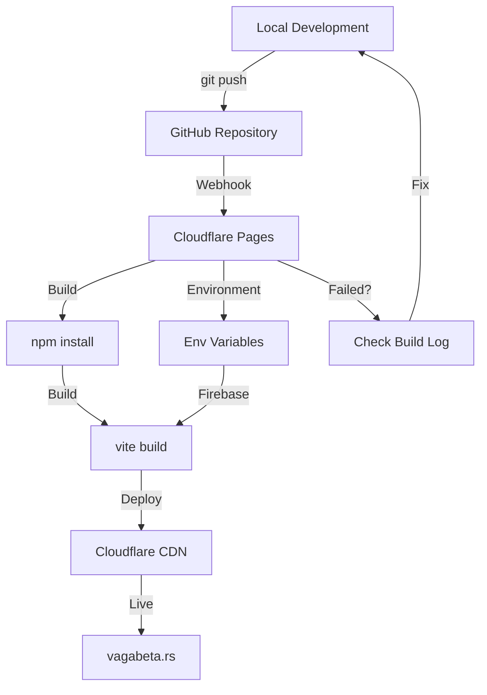

# 🚢 Deployment Documentation

> Dokumentacija za deployment Vaga Beta React aplikacije

## 📚 Sadržaj

### ☁️ Cloudflare Pages

Hosting i CDN deployment na Cloudflare Pages.

**Lokacija:** [`cloudflare/`](./cloudflare/)

**Šta ćeš naći:**

- Quick Start vodič (5 min setup)
- Kompletan setup guide
- Environment variables konfiguracija
- GitHub integration
- Troubleshooting

**👉 Počni ovde:** [cloudflare/README.md](./cloudflare/README.md)

---

### 💾 R2 Storage

Cloudflare R2 object storage i caching.

**Lokacija:** [`r2-storage/`](./r2-storage/)

**Šta ćeš naći:**

- R2 setup vodič
- Cache konfiguracija
- Implementation checklist
- Workers deployment

**👉 Počni ovde:** [r2-storage/README.md](./r2-storage/README.md)

---

### ✅ Pre-Deployment Checklist

Obavezna provera pre svakog deployment-a.

**📋 Checklist:** [PRE_DEPLOYMENT_CHECKLIST.md](./PRE_DEPLOYMENT_CHECKLIST.md)

**Što proverava:**

- ✅ Environment variables
- ✅ Build configuration
- ✅ Security headers
- ✅ Firebase setup
- ✅ Testing checklist
- ✅ Performance optimizacije

---

## 🚀 Quick Start - Deployment Flow

### 1. Pre Deployment-a

```bash
# Proveri pre-deployment checklist
cat docs/deployment/PRE_DEPLOYMENT_CHECKLIST.md

# Build i test lokalno
npm run build:prod
npm run preview
```

### 2. Cloudflare Pages Setup

```bash
# Push na GitHub
git push origin main

# U Cloudflare dashboard:
# 1. Connect GitHub repo
# 2. Dodaj environment variables
# 3. Deploy!
```

### 3. Verifikacija

```bash
# Proveri production site
open https://vagabeta.rs

# Proveri build logs
# Cloudflare dashboard → Deployments → View build log
```

---

## 📖 Deployment Guides

### Po Iskustvu

| Nivo                   | Start Ovde                                                  |
| ---------------------- | ----------------------------------------------------------- |
| **Potpuni početnik**   | [Cloudflare Complete Setup](./cloudflare/COMPLETE_SETUP.md) |
| **Imam iskustva**      | [Cloudflare Quick Start](./cloudflare/QUICK_START.md)       |
| **Samo env vars**      | [Environment Setup](./cloudflare/ENV_SETUP.md)              |
| **GitHub auto-deploy** | [GitHub Integration](./cloudflare/GITHUB_SETUP.md)          |

### Po Problemu

| Problem          | Rešenje                                               |
| ---------------- | ----------------------------------------------------- |
| Firebase ne radi | [ENV_SETUP.md](./cloudflare/ENV_SETUP.md)             |
| Build failure    | [TROUBLESHOOTING.md](./cloudflare/TROUBLESHOOTING.md) |
| CSP violation    | [TROUBLESHOOTING.md](./cloudflare/TROUBLESHOOTING.md) |
| R2 setup         | [R2 Storage Guide](./r2-storage/README.md)            |

---

## 🎯 Deployment Targets

### Production

- **URL:** https://vagabeta.rs
- **Cloudflare Pages:** https://vaga-beta.pages.dev
- **Branch:** `main`
- **Environment:** Production
- **Auto-deploy:** ✅ Enabled

### Preview/Staging

- **URL:** https://[branch].vaga-beta.pages.dev
- **Triggers:** Pull requests
- **Environment:** Preview
- **Auto-deploy:** ✅ Enabled

---

## 🔧 konfiguracioni Fajlovi

| Fajl                    | Svrha                   | Dokumentacija                                        |
| ----------------------- | ----------------------- | ---------------------------------------------------- |
| `wrangler.toml`         | Cloudflare Pages config | [Cloudflare README](./cloudflare/README.md)          |
| `public/_headers`       | Security & CSP headers  | [TROUBLESHOOTING](./cloudflare/TROUBLESHOOTING.md)   |
| `public/_redirects`     | SPA routing (minimal)   | [Pages Deployment](./cloudflare/PAGES_DEPLOYMENT.md) |
| `.nvmrc`                | Node version (20)       | [GitHub Setup](./cloudflare/GITHUB_SETUP.md)         |
| `wrangler.workers.toml` | R2 Workers config       | [R2 Storage](./r2-storage/README.md)                 |

---

## 📊 Deployment Workflow



---

## 🆘 Troubleshooting

### Build Errors

1. Proveri build log u Cloudflare dashboard
2. Testiraj lokalno: `npm run build:prod`
3. Proveri Node version (treba 20)
4. Vidi: [TROUBLESHOOTING.md](./cloudflare/TROUBLESHOOTING.md)

### Runtime Errors

1. Proveri browser konzolu (F12)
2. Proveri environment variables
3. Proveri CSP headers
4. Vidi: [ENV_SETUP.md](./cloudflare/ENV_SETUP.md)

### Performance Issues

1. Proveri Cloudflare Analytics
2. Proveri bundle size: `npm run analyze`
3. Optimizuj images i assets

---

## 📞 Additional Resources

- **Setup Guide:** [../setup/](../setup/)
- **Testing:** [../testing/](../testing/)
- **Features:** [../features/](../features/)
- **Main Docs:** [../README.md](../README.md)

---

**Poslednje ažurirano:** Februar 2026
