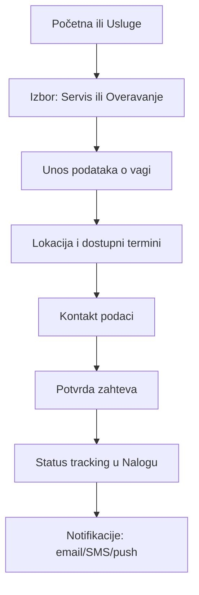
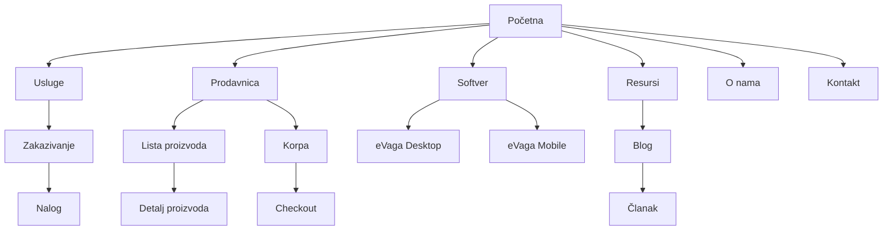

# Deep research: UI/UX redizajn i modernizacija vagabeta.rs sa profesionalnom plavom paletom

## Executive summary

Analiza javno dostupnih izvora pokazuje da je sajt trenutno izrazito zavisan od JavaScript-a: u okruženju bez izvršavanja JS-a (što je tipično za mnoge „crawler“ i audit alate, ali i za deo korisnika u restriktivnim uslovima) stranice prikazuju poruku „JavaScript je potreban“. citeturn4view0turn4view1turn4view2turn4view3 Ovaj izbor arhitekture (client-side rendering bez server-side sadržaja) je najveći “multiplikator” problema: otežava SEO, komplikuje pristupačnost, i povećava rizik performans regresija (težak JS bundle, sporiji first render). Google eksplicitno ima smernice za JavaScript SEO i način na koji obrada JS-a funkcioniše, ali i dalje je best-practice da kritične javne stranice budu indeksabilne i razumljive uz minimalno renderovanje. citeturn17search0turn17search8

Šta je najvažnije da redizajn postigne (prioritetom):

- **Jasna informacijska arhitektura** za tri glavna toka: *Usluge (servis/overa)*, *Prodavnica (kupovina)* i *Softver eVaga (B2B rešenja)*; trenutno se vidi više ulaznih tačaka i dupliranja (npr. “korpa/cart”, “login/prijava”). citeturn11search0turn11search5turn6search8turn6search9  
- **Moderni “blue-first” vizuelni sistem** (3 alternativne palete), sa proverljivim kontrastom po WCAG 2.2 (AA minimumi: 4.5:1 za normalni tekst; 3:1 za veliki tekst; 3:1 za UI komponente/ikonice). citeturn15search0turn15search3turn15search14  
- **Standardizovan dizajn sistem (tokeni)** koji se direktno prevodi u kod (CSS varijable, Tailwind theme variables ili Bootstrap CSS varijable). citeturn15search1turn15search2turn16search1turn16search2turn16search8  
- **Merljiva performansa (Core Web Vitals)** i disciplina kroz Lighthouse/PSI i CI kontrole. citeturn18search3turn15search9turn15search25  
- **Uvođenje “booking” toka** za servis/overavanje sa praćenjem statusa (nalog), uz jasne mikrointerakcije i validacije. (Ovo direktno podržava vrednost koju već komunicirate kroz eVaga mobile funkcije kao što su “zakazivanje servisa”, “istorija servisa”, “push notifikacije”). citeturn8search3turn10search1  

Preporuka za “default” smer redizajna: **Paleta A (Cobalt Navy)** + tipografija *Inter (body/UI)* + *Manrope (naslovi)*, uz 8pt spacing i dizajn tokene. Standardizovati URL-ove i jezik (sr-Latn kao primarno), zatim dodati EN kroz i18n.

## Inventar sajta i audit trenutnog stanja

### Metodologija i ograničenja istraživanja

- Inventar je izveden iz javno indeksiranih URL-ova i dostupnih snippeta pretrage, jer server-side prikaz stranica bez JS-a vraća samo poruku da je JavaScript potreban. citeturn4view0turn6search1turn6search2turn6search3turn6search10  
- Sitemap i robots.txt nisu bili direktno otkriveni kroz javne rezultate u ovom setu izvora, pa se ne može potvrditi da li postoje i gde su objavljeni. (To nije dokaz da ne postoje; znači da nisu trivijalno pronađeni kroz dostupne indeksirane rezultate.) Google daje jasne smernice kako sitemap učiniti vidljivim (Search Console, robots.txt direktiva). citeturn17search1turn17search2turn17search5  

Praktična posledica: UI detalji (tačna tipografija, spacing, grid, komponente) nisu verifikovani vizuelnim “live renderom”, pa se audit oslanja na arhitekturu, rute, konzistentnost, i best-practice/standarde.

### Inventar stranica, šablona i uočenih tokova

U javno vidljivim rezultatima pojavljuju se sledeće rute (grupisano po tipu):

**Marketing / informativne stranice**
- Početna: `/` citeturn6search0turn11search1  
- Usluge: `/usluge` citeturn6search1turn7search1  
- O nama: `/onama/` citeturn6search3  
- Proizvodi (verovatno kategorije): `/proizvodi` citeturn6search11turn7search5  
- Aplikacija (eVaga Mobile / rani pristup): `/aplikacija` citeturn6search4turn10search1  
- eVaga Desktop: `/evaga-desktop` citeturn10search0turn13search6  
- Politika privatnosti: `/privacy` citeturn6search10turn7search2  

**Prodavnica / e-commerce**
- Prodavnica landing: `/prodavnica` (primećen i `www` prefiks u nekim rezultatima) citeturn6search2turn13search2  
- Lista proizvoda: `/prodavnica/proizvodi` (sa query parametrima) citeturn6search5turn11search4  
- Korpa: `/prodavnica/korpa` i takođe `/prodavnica/cart` (dupliranje jezika) citeturn11search0turn11search5  
- Prijava u prodavnici: `/prodavnica/prijava` citeturn6search8turn11search3  
- Login (druga ruta): `/login` citeturn6search9  

**Zaključak o šablonima (templates)**
- Template A: Marketing landing (hero + sekcije + CTA) — `/`, `/usluge`, `/proizvodi`, `/aplikacija`, `/evaga-desktop`, `/onama/`
- Template B: Shop listing — `/prodavnica`, `/prodavnica/proizvodi`
- Template C: Cart — `/prodavnica/korpa` i alias `/prodavnica/cart`
- Template D: Auth — `/prodavnica/prijava`, `/login`
- Template E: Legal — `/privacy`

### Audit po oblastima

**Informacijska arhitektura i navigacija**
- Snippeti ukazuju na top navigaciju sa stavkama tipa “Početna, Prodavnica, Usluge, Kontakt, O nama”, ali “Kontakt” ruta nije potvrđena kao indeksirana stranica (moguće postoji kao deo SPA ali nije otkrivena ovim putem). citeturn7search5turn7search0  
- Postoji rizik od konfuzije između “Proizvodi” (kategorijski sadržaj) i “Prodavnica” (transakcioni tok). Ovo je čest IA problem u B2B/B2C hibridima: korisnik želi ili *informaciju* (specifikacije, standardi, servis) ili *kupovinu* (cena, dostupnost, isporuka). Preporuka: eksplicitno razdvajanje kroz IA i nazivlje (“Tipovi vaga” vs “Prodavnica”). citeturn18search1turn18search14  

**Konzistentnost jezika i URL-ova**
- Prisutnost `/korpa` i `/cart`, kao i `/prijava` i `/login`, ukazuje na nekonzistentnu lokalizaciju ruta i potencijalno duplirane ekrane. citeturn11search0turn11search5turn6search8turn6search9  
- Ovo je i UX i SEO rizik (duplirani ekvivalenti, kanonikalizacija). Google developer dokumentacija generalno naglašava važnost tehničke urednosti (brzo, dostupno, radi na svim uređajima). citeturn17search8  

**SEO osnove (posebno kritično zbog JS rendera)**
- Sajt bez JS-a praktično ne isporučuje sadržaj (server-side), što otežava indeksaciju i preview (npr. deljenje na društvenim mrežama, neki botovi ne renderuju). citeturn4view0turn17search0  
- Neophodno je obezbediti: SSR/SSG ili bar prerender za javne stranice + sitemap + robots.txt i pravilno izlaganje sitemap lokacije. citeturn17search1turn17search2turn17search5  

**Pristupačnost (WCAG)**
- WCAG 2.2 definiše minimalne pragove kontrasta za tekst (4.5:1) i large text (3:1). citeturn15search0turn15search3  
- Za UI komponente i ikonografiju relevantan je minimum kontrast od 3:1 u kontekstu non-text contrast (npr. fokus indikatori, ikonice koje nose značenje). citeturn15search14  
- SPA pristup tipično zahteva dodatnu pažnju za fokus management, dijaloge, combobox/search i sl. WAI-ARIA Authoring Practices daje konkretne obrasce (npr. combobox) i očekivana ponašanja (Esc zatvara bez gubitka izbora, tastatura navigacija). citeturn18search0turn18search12  

**Performanse**
- Core Web Vitals ciljevi: LCP ≤ 2.5s, INP ≤ 200ms, CLS ≤ 0.1 su standardni pragovi za “good” UX. citeturn18search3turn18search11  
- Preporučeni proces: audit kroz Lighthouse (performanse, accessibility, SEO) i automatizacija kroz CI. citeturn15search9turn19search2turn15search25  

**Content gap (šta nedostaje da bi korisnik doneo odluku)**
- Na osnovu pozicioniranja (“servis/žigosanje/overavanje”, prodavnica vaga, softverska rešenja) potrebno je pojačati: *dokaz poverenja* (sertifikati, ovlašćenja, reference), *FAQ* za proces overe, *jasan tok zakazivanja*, *detalji isporuke/garancije/servisa* za prodavnicu.
- Za e-commerce deo, Nielsen Norman Group naglašava da su stranice proizvoda “workhorse” koje moraju odgovoriti na pitanja korisnika i pripremiti ga za kupovinu. citeturn18search1  

## Dizajn sistem i vizuelni jezik

### Plave palete sa kontrastom i namenom

Napomena o standardu: pragovi kontrasta (AA) za normalni tekst su 4.5:1; za veliki tekst 3:1, a vrednosti se tretiraju kao pragovi bez zaokruživanja. citeturn15search0turn15search3  

U nastavku su 3 distinktne “blue-first” palete. Kontrast ratio vrednosti su izračunate za ključne parove (npr. beli tekst na primarnoj boji), kako bi CTA dugmad i linkovi bili bezbedni za WCAG AA.

#### Paleta A: Cobalt Navy

Karakter: ozbiljan, industrijski, “B2B trust”.

Ključne boje i upotreba:
- Primary (CTA, primarni linkovi): `#0B3A8D`  
- Secondary (sekundarni CTA, info linkovi): `#1D4ED8`  
- Accent (naglasci, info badge, sekundarni highlight): `#0E7490`  
- Background: `#F8FAFC`, Surface: `#FFFFFF`, Surface tint: `#EFF6FF`  
- Text: `#0B1220`, Muted: `#475569`, Border: `#CBD5E1`

Kontrast (ključni parovi):
- White on Primary: **10.48:1** (AA/AAA bezbedno)  
- Secondary on White: **6.70:1** (AA bezbedno)  
- Accent on White: **5.36:1** (AA bezbedno)

Preporučena upotreba:
- Primarna dugmad i linkovi: Primary
- Sekundarna dugmad (outline ili solid): Secondary
- Status “info” i pomoćni highlight: Accent (ali kontrolisano)

#### Paleta B: Azure Professional

Karakter: modern-tech, “cloud/SaaS” vibe (dobro se uklapa uz eVaga priču).

- Primary: `#0A66C2`  
- Secondary: `#2563EB`  
- Accent: `#4F46E5`  
- Background: `#F6F8FF`, Surface: `#FFFFFF`, Surface tint: `#E0F2FE`  
- Text: `#0A0F1F`, Muted: `#475569`, Border: `#D0D7E2`

Kontrast:
- White on Primary: **5.69:1** (AA bezbedno)  
- Secondary on White: **5.17:1** (AA bezbedno)  
- Accent on White: **6.29:1** (AA bezbedno)

Preporučena upotreba:
- Primary za “glavne” akcije (Kupite, Zakažite servis)
- Accent (indigo) za sekcije softvera, tabove, aktivne filtere

#### Paleta C: Blue-Gray Electric

Karakter: “enterprise” + energičan akcenat, odlična za dashboard/nalog.

- Primary: `#003B73`  
- Secondary: `#0057B8`  
- Accent: `#0077B6`  
- Background: `#F3F7FF`, Surface: `#FFFFFF`, Surface tint: `#E7F0FF`  
- Text: `#0B1220`, Muted: `#334155`, Border: `#C9D5E5`

Kontrast:
- White on Primary: **11.21:1** (AA/AAA bezbedno)  
- Accent on White: **4.87:1** (AA bezbedno)  

Preporučena upotreba:
- Primary za navigaciju i CTA
- Accent za “aktivno stanje” (npr. izabrani filter chip) i info grafiku

### “Swatches” i tokeni: primer CSS varijabli

Smernice: koristiti dizajn tokene kao “single source of truth” (Material design tokens, Tailwind “theme variables”, Bootstrap CSS varijable, Figma variables). citeturn15search1turn15search2turn16search1turn16search2turn16search8  

Primer (Paleta A) — predlog naming konvencije:

```css
:root {
  /* Brand */
  --color-brand-primary: #0B3A8D;
  --color-brand-primary-hover: #072B6E;
  --color-brand-secondary: #1D4ED8;
  --color-brand-accent: #0E7490;

  /* Neutrals */
  --color-bg: #F8FAFC;
  --color-surface: #FFFFFF;
  --color-surface-tint: #EFF6FF;
  --color-border: #CBD5E1;

  /* Text */
  --color-text: #0B1220;
  --color-text-muted: #475569;

  /* Focus */
  --color-focus-ring: #1D4ED8;
  --focus-ring: 0 0 0 3px rgba(29, 78, 216, 0.35);

  /* Spacing (8pt grid) */
  --space-1: 4px;
  --space-2: 8px;
  --space-3: 12px;
  --space-4: 16px;
  --space-5: 24px;
  --space-6: 32px;
  --space-7: 48px;
  --space-8: 64px;

  /* Radius */
  --radius-sm: 8px;
  --radius-md: 12px;
  --radius-lg: 16px;
}
```

Minimalni “swatch” snippet (za internu dokumentaciju dizajn sistema):

```html
<div style="display:flex;gap:12px;flex-wrap:wrap">
  <div><div style="width:56px;height:56px;background:#0B3A8D;border-radius:12px"></div><small>#0B3A8D</small></div>
  <div><div style="width:56px;height:56px;background:#1D4ED8;border-radius:12px"></div><small>#1D4ED8</small></div>
  <div><div style="width:56px;height:56px;background:#0E7490;border-radius:12px"></div><small>#0E7490</small></div>
  <div><div style="width:56px;height:56px;background:#F8FAFC;border:1px solid #CBD5E1;border-radius:12px"></div><small>#F8FAFC</small></div>
</div>
```

### Tipografija i skale

Cilj: profesionalno, čitljivo, “industrijski pouzdano” — uz dobru podršku za sr-Latn, brojeve, tabele specifikacija.

Preporučena uparivanja (izabrati jedno i standardizovati):

- **Opcija 1 (top preporuka)**: *Inter* (UI/body) + *Manrope* (naslovi)  
  - Prednost: moderan “product” osećaj, odlična čitljivost, dobar rendering na ekranima.
- Opcija 2: *IBM Plex Sans* (UI/body) + *IBM Plex Serif* (naslovi/quote)  
  - Prednost: “enterprise” identitet, odlična hijerarhija.
- Opcija 3: *Roboto* (UI/body) + *Roboto Slab* (naslovi)  
  - Prednost: blisko Material ekosistemu.

Tip skala (primer):
- H1: 36–44px / 1.15
- H2: 28–32px / 1.2
- H3: 22–24px / 1.25
- Body: 16–18px / 1.5
- UI small: 14px / 1.4
- Caption: 12px / 1.35

Razmak i grid:
- 8pt grid kao osnova (4px kao “fine step”).
- Maks širina teksta (reading width): 60–75 karaktera (za blog/FAQ).

### Pristupačnost kao dizajn constraint

- Kontrast: planirati token “text-on-primary”, “text-on-surface”, “border-default” i proveriti AA pragove. citeturn15search0turn15search3turn15search14  
- Fokus ring: vidljiv, konzistentan; ne oslanjati se samo na boju.
- Interaktivni obrasci (search combobox, filter dropdown, modal) implementirati po WAI-ARIA APG obrascima. citeturn18search0turn18search12  

## Preporuke po tipovima stranica

U nastavku su predlozi za *ključne tipove stranica* koje ste tražili: home, listing, detail, blog, about/contact, checkout/booking, user account. Svaka sekcija uključuje: strukturu (wireframe), komponente, mikrointerakcije i hijerarhiju.

### Početna

Primarni cilj: brzo razdvojiti korisnike po nameri:
1) “Treba mi servis/overa”  
2) “Hoću da kupim vagu”  
3) “Treba mi softver eVaga”

**Predložena struktura (wireframe)**

```
[Top bar: tel | radno vreme | lokacija | jezik SR/EN]
[Header: Logo | Usluge | Prodavnica | Softver | Resursi | O nama | Kontakt | (Search) | Korpa | Nalog]
[Hero]
  - H1: Servis i overavanje vaga + prodaja + softver
  - 2 CTA: Zakaži servis (primary) | Pogledaj prodavnicu (secondary)
  - Trust badges: 20+ god / ovlašćenja / brza usluga (ako je tačno)
[Section: 3 stuba]
  - Servis & održavanje
  - Overavanje/žigosanje
  - Softverska rešenja (eVaga)
[Section: Kategorije vaga (cards)]
  - Paletne | Kamionske | Platformske | Mehaničke ...
[Section: Izdvojeni proizvodi (carousel + quick add)]
[Section: Kako funkcioniše overa/servis (3 koraka)]
[Section: Reference i “social proof”]
[Footer: kontakt, linkovi, pravno, mreže]
```

Usklađivanje sa sadržajem koji se već pojavljuje u snippetu (kategorije tipa paletna/kamionska/platformska/mehanička). citeturn11search1  

**Ključne komponente**
- Sticky header sa “shrink” ponašanjem (na scroll)
- Hero sa jasnim CTA
- “Choice cards” (3 namere)
- Kategorije kao grid kartice (sa ikonama i kratkim benefitima)
- Trust blok (sertifikati, logoi klijenata, broj intervencija — strogo samo proverljive tvrdnje)

**Mikrointerakcije**
- Hover: blagi lift + border highlight
- CTA: loading state + disable tokom submit
- Animacije: samo “subtle”, prefer-reduced-motion poštovati

### Kategorija / listing

Postoje najmanje dve ulazne tačke: “Proizvodi” i “Prodavnica / proizvodi”. citeturn6search11turn6search2turn6search5  
Predlog: napraviti jasnu podelu na:
- **Kategorijski informativni listing** (tipovi vaga, edukativno)
- **Shop listing** (transakcioni)

**Predloženi listing layout (shop)**

```
[Header + breadcrumb]
[H1 + opis + count rezultata]
[Toolbar]
  - Search (typeahead)
  - Sort (relevance, cena, najprodavanije)
  - View toggle (grid/list)
[Left filter panel (desktop) / bottom sheet (mobile)]
  - Tip vage
  - Nosivost (range)
  - Preciznost / klasa
  - Namena (industrija, skladište, kamioni...)
  - Dostupnost
  - Cena
[Product grid]
  - Kartica: slika, naziv, ključne specifikacije (3), cena/“po upitu”, CTA
[Pagination ili infinite + “load more”]
```

**Komponente**
- Filter “chips” iznad grida (pokazuje aktivne filtere)
- “Empty state” kad nema rezultata
- “Quick compare” (do 3 proizvoda)

**Mikrointerakcije i a11y**
- Filter panel: trap focus kada je otvoren kao modal na mobilnom
- Combobox i dropdown po APG obrascima; Esc zatvara bez “gubitka” unosa. citeturn18search0turn18search12  

### Stranica proizvoda / detalj

S obzirom na e-commerce prirodu, detalj mora sadržati tehničke specifikacije i jasnoću oko kupovine/ponude. NN/g naglašava da product page mora odgovoriti na pitanja i pripremiti kupca za kupovinu. citeturn18search1  

**Predloženi detalj layout**

```
[Breadcrumb]
[Gallery (left) | Buy box (right)]
  - Naziv + SKU/Model
  - Cena / “po upitu”
  - Dostupnost, isporuka
  - CTA: Dodaj u korpu / Pošalji upit
  - Secondary: Preuzmi specifikaciju (PDF)
[Tabs/accordions]
  - Opis
  - Specifikacije (tabela)
  - Sertifikati/usaglašenost
  - Servis i garancija
  - Pitanja (FAQ)
[Cross-sell]
  - Oprema, dodatci, slični proizvodi
[Trust]
  - Recenzije / studije slučaja (kada postoji)
```

**Komponente**
- Gallery sa zoom/lightbox (uz tastaturu: Esc zatvara)
- Spec tabela (responsivno: “definition list” na mobilnom)
- “Sticky buy box” na desktop, “sticky bottom bar” na mobilnom

**Mikrointerakcije**
- “Add to cart” toast sa Undo
- Skeleton loader za galeriju i cenu
- Validacija količine (stepper input)

### Blog / članak

Ako blog trenutno ne postoji (nije otkriven u indeksiranim rutama), preporuka je da se uvede kao “Resursi”/“Vodiči” zbog SEO i poverenja, posebno za teme: overavanje/žigosanje, izbor vage, održavanje, softver integracije.

**Article template**

```
[Header + breadcrumb]
[H1 + meta (datum, autor/kompanija)]
[TOC (desktop sticky)]
[Body]
  - short intro
  - sekcije sa H2/H3
  - callout box (tip/procedura)
[CTA strip]
  - Zakaži servis | Kontaktiraj prodaju
[Related articles]
```

**SEO i kvalitet**
- Interno linkovanje ka uslugama i prodavnici
- Strukturirani podaci (Article) i “FAQ” schema gde odgovara

### O nama i Kontakt

O nama već postoji kao ruta. citeturn6search3 Kontakt kao stavka u navigaciji se pojavljuje u snippetima, ali ruta nije potvrđena. citeturn7search0turn7search5  

**Predlog: spojeni “O nama / Kontakt” hub sa jasnim sekcijama**
- O nama: misija, tim, istorija (samo proverljive tvrdnje), ovlašćenja, oprema, servisna zona
- Kontakt: forme po nameri (servis, prodaja, softver), mapa, radno vreme, SLA očekivanja

**Kontakt forma (konverzijski dizajn)**
- Izbor razloga (radio): Servis | Overa | Kupovina | Softver
- Pametna polja po izboru (progressive disclosure)
- Obavezna polja minimalna
- Jasna izjava o privatnosti (link ka politici privatnosti) citeturn6search10turn7search2  

### Checkout i booking

S obzirom da postoji korpa, e-commerce checkout je potreban, ali jednako važan je i **booking toka** za servis/overavanje (što je core biznis signal u copy-ju i u eVaga mobile obećanju). citeturn6search2turn8search3  

**Predlog: dva toka**
- Checkout (kupovina)
- Booking (zakazivanje servisa / overe)

**Mermaid: Booking flow (servis/overavanje)**



**Booking page struktura (wireframe)**

```
[Stepper: 1 Vrsta usluge > 2 Detalji > 3 Termin > 4 Kontakt > 5 Potvrda]

Korak 1: Servis / Overavanje / Održavanje
Korak 2: Tip vage + serijski broj + opis problema + upload fotografije
Korak 3: Izbor termina + hitnost
Korak 4: Podaci firme/lični + adresa + napomene
Korak 5: Rezime + potvrda
```

A11y:
- Stepper mora biti navigabilan tastaturom
- Greške per-field + summary na vrhu (sa “skip to error” linkovima)

**Checkout smernice**
- Minimalan broj polja, guest checkout opcija (ako poslovni model dozvoljava)
- Jasno: isporuka, troškovi, rok, povraćaj

Smashing Magazine checkout smernice su korisne za opšti okvir (iako je stariji članak, principi “friction reduction” su i dalje primenljivi). citeturn18search34  

### User account

Trenutno postoje login rute, ali nije jasno da li je nalog fokusiran na kupovinu, servis, ili eVaga. citeturn6search8turn6search9  
Preporuka: “Nalog” kao centralno mesto (B2B portal lite).

**Struktura naloga**
- Dashboard: otvoreni zahtevi (servis/overa), poslednje porudžbine, predradnje
- Moji zahtevi: status, istorija, dokumenti (PDF potvrde)
- Porudžbine: fakture, isporuka
- Moje vage/oprema: evidencija uređaja (ako postoji eVaga integracija)
- Podešavanja: firma, adrese, korisnici

Mikrointerakcije:
- Status “chips” (npr. Primljeno, U obradi, Zakazano, Završeno)
- Inline upload dokumenata
- Export (CSV/PDF) za firme

## Nova funkcionalnost i prioritizacija

### Predložene nove funkcije

**Pretraga i filtriranje (P0)**
- Global search (header) sa autosuggest (proizvodi + usluge + članci).
- Faceted filters u prodavnici + “saved filters”.

A11y: combobox implementacija po WAI-ARIA obrascu. citeturn18search0turn18search12  

**Booking i praćenje servisa (P0)**
- Online zakazivanje + status tracking + notifikacije.
- Upariti sa benefitima koji se već komuniciraju za eVaga mobile (zakazivanje, istorija, push). citeturn8search3turn10search1  

**Multilingual (P1)**
- SR (lat) + EN; standardizovati rute i prevode (ukloniti “cart” duplikat ili ga mapirati kroz i18n strategiju).
- SEO: hreflang + sitemap sa alternates. citeturn17search23  

**PWA / offline (P1–P2, zavisno od cilja)**
- Minimalno: installability + offline fallback (core PWA checklist). citeturn19search0turn19search6  
- Naprednije: offline keš za katalog i poslednje gledane proizvode; service worker i caching strategije. citeturn19search1turn19search4  

**Recenzije i social proof (P1)**
- Recenzije proizvoda/usluge gde je realno (B2B: često “case studies” bolje od recenzija).
- Logo wall + metričke tvrdnje samo ako su proverljive.

**Chat i podrška (P2)**
- Chat widget (radno vreme + ticket fallback), naročito za servis.

**Analytics/event schema (P0)**
- Eventi: search query, filter applied, product view, add-to-cart, begin checkout, submit booking, submit contact.
- Povezati sa Core Web Vitals monitoringom (CWV su važni i za UX i za Search). citeturn18search7turn18search31  

### Prioritizacija po principu ROI (sa procenom effort-a)

Okvir za merenje: Core Web Vitals pragovi (LCP/INP/CLS) + Lighthouse audit kao ulaz, i Search Console za indeksaciju. citeturn18search3turn18search11turn15search9turn17search15  

Tabela (brza procena):

| Funkcija / poboljšanje | Vrednost | Effort | Prioritet |
|---|---:|---:|---|
| SSR/SSG za javne stranice + SEO metadata | veoma visoka | visoko | P0 |
| Booking tok + status | veoma visoka | srednje/visoko | P0 |
| Pretraga + faceted filteri u prodavnici | visoka | srednje | P0 |
| Standardizacija ruta i jezika (korpa/cart, login/prijava) | srednja | nisko/srednje | P0 |
| Design tokens + komponentna biblioteka | visoka | srednje | P0 |
| PWA (osnovni offline fallback) | srednja | srednje | P1 |
| Multilingual SR/EN | srednja | srednje/visoko | P1 |
| Recenzije/case studies | srednja | srednje | P1 |
| Personalizovane preporuke | srednja | visoko | P2 |
| Chat | niska/srednja | nisko/srednje | P2 |

## Predlog nove IA i sitemap strukture

### Mermaid: predložena struktura sajta



### Tabela: trenutna vs predložena organizacija

Trenutno stanje je zasnovano na otkrivenim rutama (javne pretrage) i zato sadrži “nepoznato/nesigurno” gde nije potvrđeno indeksiranjem.

| Namena | Trenutno (otkriveno) | Predlog (novo) | Napomena |
|---|---|---|---|
| Početna | `/` citeturn6search0 | `/` | Ostaviti |
| Usluge | `/usluge` citeturn6search1 | `/usluge` + podstranice (servis, overa…) | Dodati “Zakazivanje” |
| O nama | `/onama/` citeturn6search3 | `/o-nama` | Standardizovati slug |
| Kategorije proizvoda (informativno) | `/proizvodi` citeturn6search11 | `/tipovi-vaga` (informativno) | Razdvojiti od prodavnice |
| Prodavnica | `/prodavnica` citeturn6search2 | `/prodavnica` | Ostaviti kao transakcioni hub |
| Lista proizvoda | `/prodavnica/proizvodi` citeturn6search5 | `/prodavnica` (listing) + `/prodavnica/kategorija/:slug` | Ugasiti dupliranje ako je nepotrebno |
| Korpa | `/prodavnica/korpa` i `/prodavnica/cart` citeturn11search0turn11search5 | `/prodavnica/korpa` | “cart” kao EN varijanta u i18n, ne kao dupla ruta |
| Checkout | (nije otkriveno) | `/prodavnica/placanje` | Uvesti |
| Login | `/prodavnica/prijava`, `/login` citeturn6search8turn6search9 | `/nalog/prijava` | Jedna ulazna tačka, role-based |
| Nalog | (nije otkriveno) | `/nalog` | Praćenje porudžbina i zahteva |
| Softver | `/aplikacija`, `/evaga-desktop` citeturn6search4turn10search0 | `/softver/evaga-desktop`, `/softver/evaga-mobile` | Jedinstven “Softver” hub |
| Privatnost | `/privacy` citeturn6search10 | `/politika-privatnosti` | Lokalizovati slug |
| Resursi / blog | (nije otkriveno) | `/resursi` + `/blog` + `/faq` | Za SEO i podršku |

### Sitemap i robots preporuke

- Objaviti **sitemap index** i navesti ga u `robots.txt` (Sitemap: …), kao što preporučuje Google. citeturn17search1turn17search2  
- Poštovati pravila domena/protokola/hosta za robots (npr. `www` i non-`www` tretirati konzistentno) i držati robots u root-u. citeturn17search5  
- Ako ostaje SPA: obavezno generisati sitemap iz izvora istine (CMS/baza) i obezbediti SSR/SSG za javne landing stranice radi robustnosti. citeturn17search0turn17search23  

## Tehnologije, alati i implementacioni roadmap

### Preporučeni alati i biblioteke

Za izbor, cilj je: **dizajn tokeni → komponentna biblioteka → audit/CI** (disciplinovan sistem).

**Dizajn i prototip**
- entity["company","Figma","design platform company"]: variables za tokene i višemodni dizajn (light/dark ili brend varijante). citeturn16search8turn16search2  
- Tokens Studio (plugin) za sinhronizaciju tokena design↔code (korisno ako tim sazri). citeturn16search15  

**Dizajn sistem / implementacija**
- Tailwind (theme variables/tokens) — jak za brz razvoj i konzistentnost. citeturn15search2turn15search17  
- Bootstrap 5.3 (CSS variables, color modes) — brza isporuka i standardizacija, ali može delovati “generic” bez dobrog theming-a. citeturn16search1turn16search14turn16search4  
- Storybook za komponent-driven razvoj, dokumentaciju i testiranje “edge states”. citeturn16search3turn16search5  

**Pristupačnost**
- axe / Deque pravila i checkliste (automatizacija) + ručni test sa tastaturom/screen reader.
- WAI-ARIA APG kao referenca za kompleksne komponente (combobox, dialog). citeturn18search12turn18search0  

**Performanse i monitoring**
- Lighthouse za audit (perf/a11y/SEO), uključivo kroz PageSpeed Insights (PSI koristi Lighthouse). citeturn15search9turn15search25turn19search2  
- Core Web Vitals definicije i pragovi: web.dev + Search Console CWV report. citeturn18search3turn18search31  

**Analitika**
- Event schema + funnel za prodavnicu i booking.
- CWV + poslovni KPI (submit booking, add-to-cart, checkout completion).

### Pros/cons i prioritet (pragmatično)

P0 (odmah, jer otključava sve ostalo):
- SSR/SSG strategija za javne stranice (rešava “JS required” problem za crawlers i robustnost) citeturn4view0turn17search0  
- Design tokens + osnovni komponentni set (Button, Input, Select, Card, Modal, Toast)
- Lighthouse baseline + CI gate (sprečavanje regresija) citeturn15search9turn19search2  

P1:
- Blog/FAQ (ako SEO i edukacija bitni)
- i18n (SR/EN)
- PWA minimalni checklist (offline fallback) citeturn19search0turn19search6  

P2:
- Personalizacija preporuka
- Chat
- Advanced PWA (offline katalog, background sync)

### Roadmap faze sa quick wins

Faza “Discovery i merenje” (effort: **srednje**)
- Lighthouse/PSI baseline, CWV baseline, mapiranje konverzija. citeturn15search9turn18search31turn15search25  
- Inventar svih ruta iz aplikacije (interni crawl iz router-a) + generisanje sitemap-a. citeturn17search1turn17search23  

Quick wins (effort: **nisko**)
- Standardizovati rute (ukloniti duplikate `/cart` vs `/korpa`, `/login` vs `/prijava`). citeturn11search0turn6search8  
- Uvesti WCAG-safe plavu paletu i fokus ring po tokenima. citeturn15search0turn15search14  
- Dodati sitemap i navesti ga u robots.txt (ako već nije). citeturn17search1turn17search2  

Faza “IA + dizajn sistem” (effort: **srednje**)
- Finalizacija Palete A/B/C → izbor jedne
- Definisanje tipografije, spacing, grid, komponenti
- Storybook setup + dokumentacija (komponentne smernice). citeturn16search3turn16search23  

Faza “Redizajn ključnih javnih stranica” (effort: **visoko**)
- Početna, Usluge, Proizvodi/tipovi, Softver
- SSR/SSG ili bar prerender za javne landing stranice (izlazak iz “JS required” rizika). citeturn4view0turn17search0  

Faza “Prodavnica: listing + detail + checkout” (effort: **visoko**)
- Faceted filters, search combobox (a11y), product detail sa specifikacijama
- Checkout i tracking

Faza “Booking + nalog” (effort: **srednje/visoko**)
- Stepper booking tok
- Status tracking u nalogu
- Notifikacije (email/SMS; push kasnije)

Faza “Optimizacije i rast” (effort: **srednje**)
- PWA checklist i offline fallback. citeturn19search0turn19search1turn19search4  
- i18n, blog/FAQ, social proof, analitika iteracije

**Napomena o riziku i zavisnostima:** dokle god server-side isporuka javnih stranica ostaje “prazna bez JS”, biće teže obezbediti stabilan SEO i kvalitetne audit rezultate. Zato SSR/SSG treba tretirati kao “platform upgrade”, ne kao kozmetiku. citeturn4view0turn17search0turn15search9